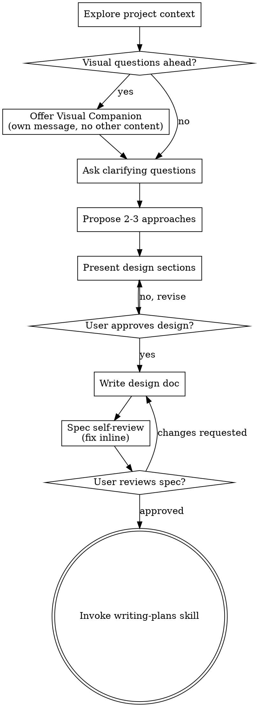

# Brainstorming de Ideas en Diseños

Ayuda a convertir ideas en diseños y specs completamente formados a través de diálogo colaborativo natural.

Comienza entendiendo el contexto actual del proyecto, luego haz preguntas una a la vez para refinar la idea. Una vez que entiendas qué estás construyendo, presenta el diseño y obtén aprobación del usuario.

<HARD-GATE>
NO invoques ninguna skill de implementación, escribas código, scaffoldes proyecto, o tomes acción de implementación hasta que hayas presentado un diseño y el usuario lo haya aprobado. Esto aplica a TODO proyecto sin importar la simplicidad percibida.
</HARD-GATE>

## Anti-Patrón: "Esto Es Demasiado Simple Para Necesitar Un Diseño"

Cada proyecto pasa por este proceso. Una lista de tareas, una utilidad de una sola función, un cambio de config — todos ellos. Los proyectos "simples" son donde las suposiciones no examinadas causan más trabajo desperdiciado. El diseño puede ser corto (unas pocas oraciones para proyectos verdaderamente simples), pero DEBES presentarlo y obtener aprobación.

## Checklist

DEBES crear una tarea para cada uno de estos items y completarlos en orden:

1. **Explorar contexto del proyecto** — chequear archivos, docs, commits recientes
2. **Ofrecer companion visual** (si el tema involucrará preguntas visuales) — este es su propio mensaje, no combinado con una pregunta clarificadora. Ver la sección Visual Companion abajo.
3. **Hacer preguntas clarificadoras** — una a la vez, entender propósito/restricciones/criterios de éxito
4. **Proponer 2-3 approaches** — con trade-offs y tu recomendación
5. **Presentar diseño** — en secciones escaladas a su complejidad, obtener aprobación del usuario después de cada sección
6. **Escribir doc de diseño** — guardar en `docs/superpowers/specs/YYYY-MM-DD-<topic>-design.md` y commitear
7. **Spec self-review** — chequeo rápido inline por placeholders, contradicciones, ambigüedad, scope (ver abajo)
8. **Usuario revisa spec escrito** — pedir al usuario que revise el spec file antes de proceder
9. **Transición a implementación** — invocar skill writing-plans para crear plan de implementación

## Flujo de Proceso

**El estado terminal es invocar writing-plans.** NO invoques frontend-design, mcp-builder, o cualquier otra skill de implementación. La ÚNICA skill que invocas después de brainstorming es writing-plans.

## El Proceso

**Entendiendo la idea:**

- Chequea el estado actual del proyecto primero (archivos, docs, commits recientes)
- Antes de hacer preguntas detalladas, evalúa scope: si el request describe múltiples subsistemas independientes (ej. "construir una plataforma con chat, file storage, billing, y analytics"), flaggea esto inmediatamente. No gastes preguntas refinando detalles de un proyecto que necesita descomposición primero.
- Si el proyecto es demasiado grande para un spec único, ayuda al usuario a descomponer en sub-proyectos: cuáles son las piezas independientes, cómo se relacionan, en qué orden deberían construirse? Luego brainstornea el primer sub-proyecto a través del flujo de diseño normal. Cada sub-proyecto obtiene su propio ciclo spec → plan → implementation.
- Para proyectos de scope apropiado, haz preguntas una a la vez para refinar la idea
- Prefiere preguntas de múltiple choice cuando sea posible, pero open-ended también está bien
- Solo una pregunta por mensaje — si un tema necesita más exploración, divídelo en múltiples preguntas
- Enfócate en entender: propósito, restricciones, criterios de éxito

**Explorando approaches:**

- Propón 2-3 approaches diferentes con trade-offs
- Presenta opciones conversacionalmente con tu recomendación y razonamiento
- Lidera con tu opción recomendada y explica por qué

**Presentando el diseño:**

- Una vez que creas entender qué estás construyendo, presenta el diseño
- Escala cada sección a su complejidad: unas pocas oraciones si es directo, hasta 200-300 palabras si es nuanced
- Pregunta después de cada sección si se ve bien hasta ahora
- Cubre: arquitectura, componentes, data flow, manejo de errores, testing
- Estate listo para volver atrás y clarificar si algo no tiene sentido

**Diseño para aislamiento y claridad:**

- Divide el sistema en unidades más pequeñas que cada una tenga un propósito claro, se comuniquen a través de interfaces bien definidas, y puedan ser entendidas y testeadas independientemente
- Para cada unidad, deberías poder responder: ¿qué hace, cómo se usa, y de qué depende?
- ¿Puede alguien entender qué hace una unidad sin leer sus internals? ¿Puedes cambiar los internals sin romper consumers? Si no, los boundaries necesitan trabajo.
- Unidades más pequeñas y bien delimitadas también son más fáciles de usar — razonas mejor sobre código que puedes mantener en contexto a la vez, y tus ediciones son más confiables cuando los archivos están enfocados. Cuando un archivo crece, eso suele ser una señal de que está haciendo demasiado.

**Trabajando en codebases existentes:**

- Explora la estructura actual antes de proponer cambios. Sigue patrones existentes.
- Donde el código existente tiene problemas que afectan el trabajo (ej. un archivo que creció demasiado, boundaries poco claros, responsabilidades enredadas), incluye mejoras targeteadas como parte del diseño — la forma en que un buen developer mejora código en el que está trabajando.
- No propongas refactoring no relacionado. Mantente enfocado en lo que sirve al goal actual.

## Después del Diseño

**Documentación:**

- Escribe el diseño validado (spec) en `docs/superpowers/specs/YYYY-MM-DD-<topic>-design.md`
  - (Las preferencias de ubicación de spec del usuario anulan este default)
- Usa la skill elements-of-style:writing-clearly-and-concisely si está disponible
- Commitea el documento de diseño a git

**Spec Self-Review:**
Después de escribir el documento spec, míralo con ojos frescos:

1. **Placeholder scan:** ¿Algún "TBD", "TODO", secciones incompletas, o requisitos vagos? Arréglalos.
2. **Internal consistency:** ¿Alguna sección se contradice con otra? ¿La arquitectura matchea las descripciones de features?
3. **Scope check:** ¿Está lo suficientemente enfocado para un plan de implementación único, o necesita descomposición?
4. **Ambiguity check:** ¿Podría algún requisito interpretarse de dos maneras diferentes? Si es así, elige una y hazla explícita.

Arrglar cualquier issue inline. No necesitas re-revisar — solo arregla y sigue.

**User Review Gate:**
Después de que el spec review loop pase, pide al usuario que revise el spec escrito antes de proceder:

> "Spec escrito y commiteado en `<path>`. Por favor revísalo y avísame si quieres hacer cambios antes de que empecemos a escribir el plan de implementación."

Espera la respuesta del usuario. Si solicita cambios, hazlos y re-ejecuta el spec review loop. Solo procede una vez que el usuario apruebe.

**Implementación:**

- Invoca la skill writing-plans para crear un plan de implementación detallado
- NO invoques ninguna otra skill. writing-plans es el siguiente paso.

## Principios Clave

- **Una pregunta a la vez** — No abrumar con múltiples preguntas
- **Múltiple choice preferido** — Más fácil de responder que open-ended cuando sea posible
- **YAGNI ruthless** — Remover features innecesarias de todos los diseños
- **Explorar alternativas** — Siempre proponer 2-3 approaches antes de decidir
- **Validación incremental** — Presentar diseño, obtener aprobación antes de seguir
- **Sé flexible** — Vuelve atrás y clarifica cuando algo no tiene sentido

## Visual Companion

Un companion basado en navegador para mostrar mockups, diagramas y opciones visuales durante brainstorming. Disponible como herramienta — no un modo. Aceptar el companion significa que está disponible para preguntas que se beneficien de tratamiento visual; NO significa que cada pregunta pase por el browser.

**Ofreciendo el companion:** Cuando anticipes que las próximas preguntas involucrarán contenido visual (mockups, layouts, diagramas), ofrécelo una vez para consentimiento:
> "Algo de lo que estamos trabajando podría ser más fácil de explicar si puedo mostrártelo en un navegador web. Puedo armar mockups, diagramas, comparaciones y otros visuales sobre la marcha. Esta feature es todavía nueva y puede ser intensiva en tokens. ¿Quieres probarla? (Requiere abrir una URL local)"

**Esta oferta DEBE ser su propio mensaje.** No la combines con preguntas clarificadoras, resúmenes de contexto, o cualquier otro contenido. El mensaje debería contener SOLO la oferta de arriba y nada más. Espera la respuesta del usuario antes de continuar. Si declinan, procede con brainstorming text-only.

**Decisión por pregunta:** Incluso después de que el usuario acepte, decide PARA CADA PREGUNTA si usar el browser o el terminal. El test: **¿entendería el usuario esto mejor viéndolo que leyéndolo?**

- **Usa el browser** para contenido que ES visual — mockups, wireframes, comparaciones de layout, diagramas de arquitectura, diseños visuales lado a lado
- **Usa el terminal** para contenido que es texto — preguntas de requisitos, elecciones conceptuales, listas de tradeoffs, opciones text A/B/C/D, decisiones de scope

Una pregunta sobre un tema de UI no es automáticamente una pregunta visual. "¿Qué significa personalidad en este contexto?" es una pregunta conceptual — usa el terminal. "¿Qué layout de wizard funciona mejor?" es una pregunta visual — usa el browser.

Si aceptan el companion, lee la guía detallada antes de proceder:
`skills/brainstorming/visual-companion.md`
