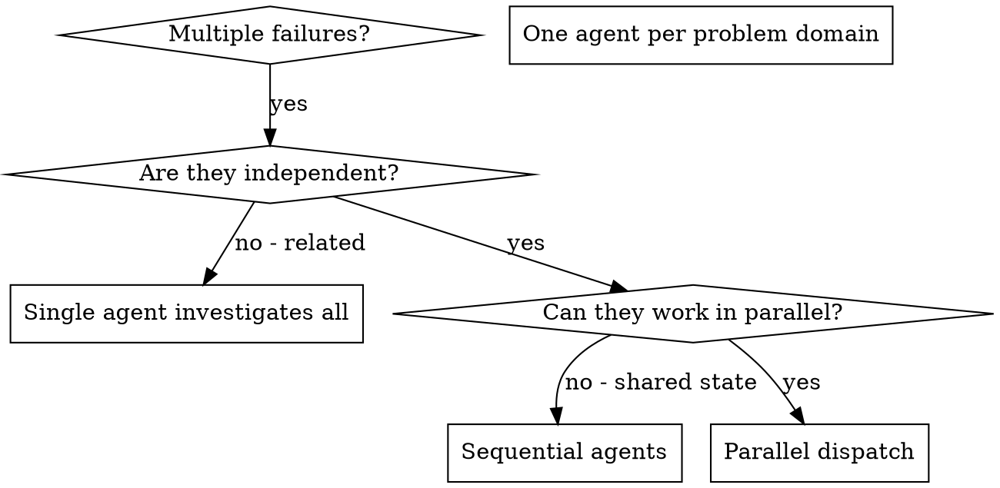

# Despachando Agentes en Paralelo

## Visión General

Delegas tareas a agentes especializados con contexto aislado. Al diseñar precisamente sus instrucciones y contexto, aseguras que se mantengan enfocados y tengan éxito en su tarea. Nunca deberían heredar el contexto o historial de tu sesión — tú construyes exactamente lo que necesitan. Esto también preserva tu propio contexto para trabajo de coordinación.

Cuando tienes múltiples fallos no relacionados (diferentes archivos de test, diferentes subsistemas, diferentes bugs), investigarlos secuencialmente desperdicia tiempo. Cada investigación es independiente y puede suceder en paralelo.

**Principio core:** Despacha un agente por dominio de problema independiente. Déjalos trabajar concurrentemente.

## Cuándo Usar



**Usar cuando:**
- 3+ archivos de test fallando con diferentes causas raíz
- Múltiples subsistemas rotos independientemente
- Cada problema puede entenderse sin contexto de otros
- No hay estado compartido entre investigaciones

**No usar cuando:**
- Los fallos están relacionados (arreglar uno podría arreglar otros)
- Necesitas entender el estado completo del sistema
- Los agentes se interferirían entre sí

## El Patrón

### 1. Identificar Dominios Independientes

Agrupa fallos por qué está roto:
- Archivo A tests: Tool approval flow
- Archivo B tests: Batch completion behavior
- Archivo C tests: Abort functionality

Cada dominio es independiente — arreglar tool approval no afecta los tests de abort.

### 2. Crear Tareas de Agente Enfocadas

Cada agente obtiene:
- **Scope específico:** Un archivo de test o subsistema
- **Goal claro:** Hacer pasar estos tests
- **Constraints:** No cambiar otro código
- **Output esperado:** Resumen de qué encontraste y arreglaste

### 3. Despachar en Paralelo

```typescript
// En Claude Code / entorno AI
Task("Fix agent-tool-abort.test.ts failures")
Task("Fix batch-completion-behavior.test.ts failures")
Task("Fix tool-approval-race-conditions.test.ts failures")
// Los tres corren concurrentemente
```

### 4. Revisar e Integrar

Cuando los agentes retornan:
- Lee cada resumen
- Verifica que los fixes no conflictúen
- Ejecuta el test suite completo
- Integra todos los cambios

## Estructura de Prompt de Agente

Buenos prompts de agente son:
1. **Enfocados** - Un dominio de problema claro
2. **Self-contained** - Todo el contexto necesario para entender el problema
3. **Específicos sobre output** - ¿Qué debería retornar el agente?

```markdown
Arreglar los 3 tests fallando en src/agents/agent-tool-abort.test.ts:

1. "should abort tool with partial output capture" - espera 'interrupted at' en message
2. "should handle mixed completed and aborted tools" - fast tool abortado instead of completed
3. "should properly track pendingToolCount" - espera 3 results pero obtiene 0

Estos son issues de timing/race condition. Tu tarea:

1. Leer el archivo de test y entender qué verifica cada test
2. Identificar causa raíz — ¿issues de timing o bugs reales?
3. Arreglar:
   - Reemplazando timeouts arbitrarios con event-based waiting
   - Arreglando bugs en implementación de abort si se encuentran
   - Ajustando expectativas de test si el comportamiento testeado cambió

NO solo aumentes timeouts — encuentra el issue real.

Retornar: Resumen de qué encontraste y qué arreglaste.
```

## Errores Comunes

**❌ Too broad:** "Fix all the tests" - agente se pierde
**✅ Specific:** "Fix agent-tool-abort.test.ts" - scope enfocado

**❌ No context:** "Fix the race condition" - agente no sabe dónde
**✅ Context:** Pastea los mensajes de error y nombres de tests

**❌ No constraints:** Agente podría refactorizar todo
**✅ Constraints:** "Do NOT change production code" or "Fix tests only"

**❌ Vague output:** "Fix it" - no sabes qué cambió
**✅ Specific:** "Return summary of root cause and changes"

## Cuándo NO Usar

**Fallos relacionados:** Arreglar uno podría arreglar otros — investigar juntos primero
**Necesita contexto completo:** Entender requiere ver el sistema entero
**Debugging exploratorio:** No sabes qué está roto todavía
**Estado compartido:** Los agentes se interferirían (editando mismos archivos, usando mismos recursos)

## Ejemplo Real de Sesión

**Scenario:** 6 test failures across 3 files after major refactoring

**Failures:**
- agent-tool-abort.test.ts: 3 failures (timing issues)
- batch-completion-behavior.test.ts: 2 failures (tools not executing)
- tool-approval-race-conditions.test.ts: 1 failure (execution count = 0)

**Decision:** Dominios independientes — abort logic separado de batch completion separado de race conditions

**Dispatch:**
```
Agent 1 → Fix agent-tool-abort.test.ts
Agent 2 → Fix batch-completion-behavior.test.ts
Agent 3 → Fix tool-approval-race-conditions.test.ts
```

**Results:**
- Agent 1: Replaced timeouts with event-based waiting
- Agent 2: Fixed event structure bug (threadId in wrong place)
- Agent 3: Added wait for async tool execution to complete

**Integration:** All fixes independent, no conflicts, full suite green

**Time saved:** 3 problems solved in parallel vs sequentially

## Key Benefits

1. **Parallelization** - Múltiples investigaciones suceden simultáneamente
2. **Focus** - Cada agente tiene scope narrow, menos contexto para trackear
3. **Independence** - Los agentes no se interfieren entre sí
4. **Speed** - 3 problemas resueltos en tiempo de 1

## Verification

Después de que los agentes retornen:
1. **Revisar cada resumen** - Entender qué cambió
2. **Chequear conflictos** - ¿Los agentes editaron el mismo código?
3. **Ejecutar suite completa** - Verificar que todos los fixes funcionan juntos
4. **Spot check** - Los agentes pueden hacer errores sistemáticos

## Real-World Impact

De sesión de debugging (2025-10-03):
- 6 failures across 3 files
- 3 agents dispatched in parallel
- All investigations completed concurrently
- All fixes integrated successfully
- Zero conflicts between agent changes
