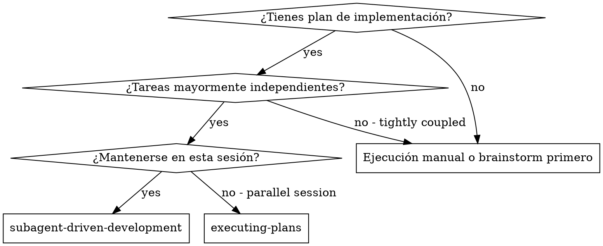
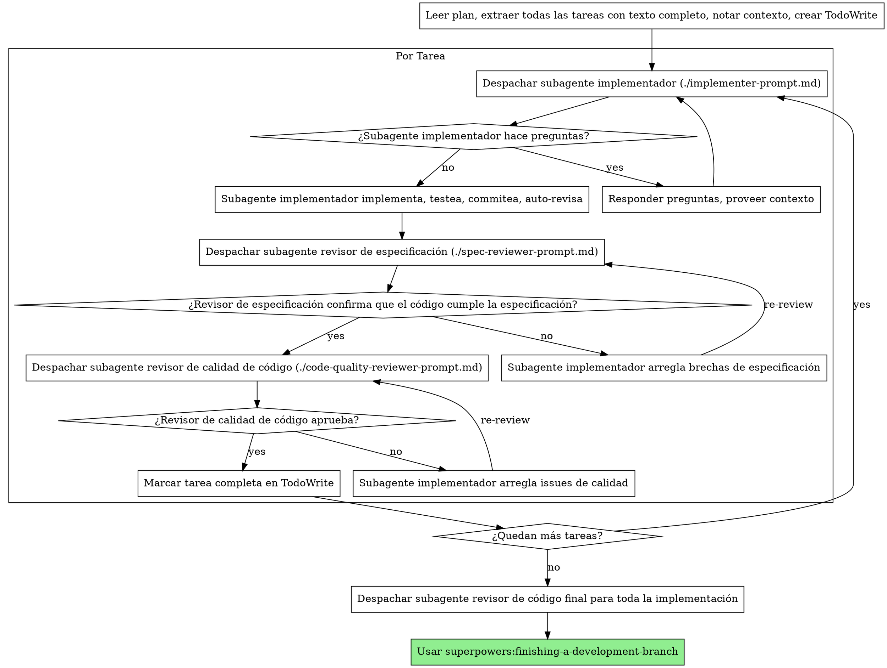

# Desarrollo Guiado por Subagentes

Ejecuta un plan despachando un subagente fresco por tarea, con revisión en dos etapas después de cada una: primero revisión de cumplimiento de especificación, luego revisión de calidad de código.

**Por qué subagentes:** Delegas tareas a agentes especializados con contexto aislado. Al diseñar precisamente sus instrucciones y contexto, aseguras que se mantengan enfocados y tengan éxito en su tarea. Nunca deberían heredar el contexto o historial de tu sesión — tú construyes exactamente lo que necesitan. Esto también preserva tu propio contexto para trabajo de coordinación.

**Principio core:** Subagente fresco por tarea + revisión en dos etapas (especificación y calidad) = alta calidad, iteración rápida

## Cuándo Usar



**vs. Executing Plans (sesión paralela):**
- Misma sesión (sin cambio de contexto)
- Subagente fresco por tarea (sin contaminación de contexto)
- Revisión en dos etapas después de cada tarea: cumplimiento de especificación primero, luego calidad de código
- Iteración más rápida (sin human-in-loop entre tareas)

## El Proceso



## Selección de Modelo

Usa el modelo menos potente que pueda manejar cada rol para conservar costo e incrementar velocidad.

**Tareas mecánicas de implementación** (funciones aisladas, especificaciones claras, 1-2 archivos): usa un modelo rápido y barato. La mayoría de tareas de implementación son mecánicas cuando el plan está bien especificado.

**Tareas de integración y juicio** (coordinación multi-archivo, matching de patrones, debugging): usa un modelo estándar.

**Tareas de arquitectura, diseño y revisión**: usa el modelo más capaz disponible.

**Señales de complejidad de tarea:**
- Toca 1-2 archivos con especificación completa → modelo barato
- Toca múltiples archivos con concerns de integración → modelo estándar
- Requiere juicio de diseño o entendimiento amplio de codebase → modelo más capaz

## Manejando Estado del Implementador

Los subagentes implementadores reportan uno de cuatro estados. Maneja cada uno apropiadamente:

**DONE:** Proceder a revisión de cumplimiento de especificación.

**DONE_WITH_CONCERNS:** El implementador completó el trabajo pero marcó dudas. Lee las preocupaciones antes de proceder. Si las preocupaciones son sobre corrección o scope, abórdalas antes de revisar. Si son observaciones (e.g., "este archivo se está haciendo grande"), anótalas y procede a revisar.

**NEEDS_CONTEXT:** El implementador necesita información que no fue proveída. Provee el contexto faltante y re-despacha.

**BLOCKED:** El implementador no puede completar la tarea. Evalúa el bloqueo:
1. Si es un problema de contexto, provee más contexto y re-despacha con el mismo modelo
2. Si la tarea requiere más razonamiento, re-despacha con un modelo más capaz
3. Si la tarea es demasiado grande, divídela en piezas más pequeñas
4. Si el plan mismo está equivocado, escala al humano

**Nunca** ignores una escalación o fuerces al mismo modelo a reintentar sin cambios. Si el implementador dijo que está atascado, algo necesita cambiar.

## Plantillas de Prompt

- `./implementer-prompt.md` - Despachar subagente implementador
- `./spec-reviewer-prompt.md` - Despachar subagente revisor de cumplimiento de especificación
- `./code-quality-reviewer-prompt.md` - Despachar subagente revisor de calidad de código

## Ejemplo de Workflow

```
Tú: Estoy usando Desarrollo Guiado por Subagentes para ejecutar este plan.

[Leer archivo de plan una vez: docs/superpowers/plans/feature-plan.md]
[Extraer todas las 5 tareas con texto completo y contexto]
[Crear TodoWrite con todas las tareas]

Tarea 1: Script de instalación de hook

[Obtener texto y contexto de Tarea 1 (ya extraídos)]
[Despachar subagente implementador con texto completo de tarea + contexto]

Implementador: "Antes de comenzar — ¿el hook debería instalarse a nivel de usuario o sistema?"

Tú: "Nivel de usuario (~/.config/superpowers/hooks/)"

Implementador: "Entendido. Implementando ahora..."
[Más tarde] Implementador:
  - Comando install-hook implementado
  - Tests agregados, 5/5 pasando
  - Auto-revisión: Descubrí que faltó flag --force, lo agregué
  - Commiteado

[Despachar revisor de cumplimiento de especificación]
Revisor de especificación: ✅ Cumple especificación — todos los requisitos cumplidos, nada extra

[Obtener SHAs de git, despachar revisor de calidad de código]
Revisor de calidad: Fortalezas: Buena cobertura de tests, limpio. Issues: Ninguno. Aprobado.

[Marcar Tarea 1 completa]

Tarea 2: Modos de recuperación

[Obtener texto y contexto de Tarea 2 (ya extraídos)]
[Despachar subagente implementador con texto completo de tarea + contexto]

Implementador: [Sin preguntas, procede]
Implementador:
  - Modos verify/repair agregados
  - 8/8 tests pasando
  - Auto-revisión: Todo bien
  - Commiteado

[Despachar revisor de cumplimiento de especificación]
Revisor de especificación: ❌ Issues:
  - Faltante: Reporte de progreso (la especificación dice "reportar cada 100 items")
  - Extra: Flag --json agregado (no solicitado)

[Implementador arregla issues]
Implementador: Removido flag --json, agregado reporte de progreso

[Revisor de especificación revisa de nuevo]
Revisor de especificación: ✅ Ahora cumple especificación

[Despachar revisor de calidad de código]
Revisor de calidad: Fortalezas: Sólido. Issues (Importante): Número mágico (100)

[Implementador arregla]
Implementador: Extraída constante PROGRESS_INTERVAL

[Revisor de calidad revisa de nuevo]
Revisor de calidad: ✅ Aprobado

[Marcar Tarea 2 completa]

...

[Después de todas las tareas]
[Despachar revisor de código final]
Revisor final: Todos los requisitos cumplidos, listo para merge

¡Listo!
```

## Ventajas

**vs. Ejecución manual:**
- Subagentes siguen TDD naturalmente
- Contexto fresco por tarea (sin confusión)
- Safe en paralelo (subagentes no interfieren)
- Subagente puede hacer preguntas (antes Y durante el trabajo)

**vs. Executing Plans:**
- Misma sesión (sin handoff)
- Progreso continuo (sin esperar)
- Checkpoints de revisión automáticos

**Ganancias de eficiencia:**
- Sin overhead de lectura de archivos (el controlador provee texto completo)
- El controlador cura exactamente qué contexto se necesita
- Subagente obtiene información completa upfront
- Preguntas surgidas antes de que el trabajo comience (no después)

**Gates de calidad:**
- Auto-revisión detecta issues antes del handoff
- Revisión en dos etapas: cumplimiento de especificación, luego calidad de código
- Loops de revisión aseguran que los fixes funcionan
- Cumplimiento de especificación previene sobre/sub-construcción
- Calidad de código asegura que la implementación esté bien construida

**Costo:**
- Más invocaciones de subagentes (implementador + 2 revisores por tarea)
- El controlador hace más trabajo de preparación (extrayendo todas las tareas upfront)
- Los loops de revisión agregan iteraciones
- Pero detecta issues temprano (más barato que debugging después)

## Red Flags

**Nunca:**
- Empezar implementación en branch main/master sin consentimiento explícito del usuario
- Saltar revisiones (cumplimiento de especificación O calidad de código)
- Proceder con issues no arreglados
- Despachar múltiples subagentes implementadores en paralelo (conflictos)
- Hacer que subagente lea archivo de plan (provee texto completo en su lugar)
- Saltar contexto de scene-setting (subagente necesita entender dónde encaja la tarea)
- Ignorar preguntas del subagente (responder antes de dejarlos proceder)
- Aceptar "casi" en cumplimiento de especificación (revisor de especificación encontró issues = no está listo)
- Saltar loops de revisión (revisor encontró issues = implementador arregla = revisar de nuevo)
- Dejar que auto-revisión del implementador reemplace revisión real (ambas son necesarias)
- **Empezar revisión de calidad de código antes de que cumplimiento de especificación esté ✅** (orden equivocado)
- Pasar a siguiente tarea mientras cualquier revisión tenga issues abiertos

**Si subagente hace preguntas:**
- Responder clara y completamente
- Proveer contexto adicional si se necesita
- No apresurarlos a la implementación

**Si revisor encuentra issues:**
- Implementador (mismo subagente) los arregla
- Revisor revisa de nuevo
- Repetir hasta aprobación
- No saltar la re-revisión

**Si subagente falla la tarea:**
- Despachar subagente de fix con instrucciones específicas
- No intentar arreglar manualmente (contaminación de contexto)

## Integración

**Skills de workflow requeridos:**
- **superpowers:using-git-worktrees** - REQUERIDO: Configurar workspace aislado antes de empezar
- **superpowers:writing-plans** - Crea el plan que esta skill ejecuta
- **superpowers:requesting-code-review** - Plantilla de code review para subagentes revisores
- **superpowers:finishing-a-development-branch** - Completar desarrollo después de todas las tareas

**Subagentes deberían usar:**
- **superpowers:test-driven-development** - Subagentes siguen TDD por cada tarea

**Workflow alternativo:**
- **superpowers:executing-plans** - Usar para sesión paralela en lugar de ejecución en misma sesión
