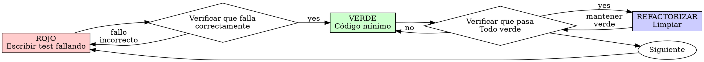

# Desarrollo Guiado por Tests (TDD)

## Visión General

Escribe el test primero. Míralo fallar. Escribe código mínimo para pasar.

**Principio core:** Si no viste el test fallar, no sabes si testea lo correcto.

**Violando la letra de las reglas se viola el espíritu de las reglas.**

## Cuándo Usar

**Siempre:**
- Nuevas features
- Bug fixes
- Refactoring
- Cambios de comportamiento

**Excepciones (pregunta a tu socio humano):**
- Prototipos descartables
- Código generado
- Archivos de configuración

¿Pensando "saltar TDD solo esta vez"? Detente. Eso es racionalización.

## La Ley de Hierro

```
NO CÓDIGO DE PRODUCCIÓN SIN UN TEST FALLANDO PRIMERO
```

¿Escribiste código antes del test? Bórralo. Empieza de nuevo.

**Sin excepciones:**
- No lo guardes como "referencia"
- No lo "adaptes" mientras escribes tests
- No lo mires
- Borrar significa borrar

Implementa fresco desde los tests. Punto.

## Rojo-Verde-Refactorizar



### ROJO — Escribir Test Fallando

Escribe un test mínimo mostrando qué debería suceder.

<Good>
```typescript
test('reintenta operaciones fallidas 3 veces', async () => {
  let attempts = 0;
  const operation = () => {
    attempts++;
    if (attempts < 3) throw new Error('fail');
    return 'success';
  };

  const result = await retryOperation(operation);

  expect(result).toBe('success');
  expect(attempts).toBe(3);
});
```
Nombre claro, testea comportamiento real, una cosa
</Good>

<Bad>
```typescript
test('retry funciona', async () => {
  const mock = jest.fn()
    .mockRejectedValueOnce(new Error())
    .mockRejectedValueOnce(new Error())
    .mockResolvedValueOnce('success');
  await retryOperation(mock);
  expect(mock).toHaveBeenCalledTimes(3);
});
```
Nombre vago, testea mock no código
</Bad>

**Requisitos:**
- Un comportamiento
- Nombre claro
- Código real (sin mocks a menos que sean inevitables)

### Verificar ROJO — Míralo Fallar

**OBLIGATORIO. Nunca saltar.**

```bash
npm test path/to/test.test.ts
```

Confirma:
- El test falla (no errores)
- El mensaje de failure es esperado
- Falla porque falta la feature (no typos)

**¿El test pasa?** Estás testeando comportamiento existente. Arregla el test.

**¿El test da error?** Arregla el error, re-ejecuta hasta que falle correctamente.

### VERDE — Código Mínimo

Escribe el código más simple para pasar el test.

<Good>
```typescript
async function retryOperation<T>(fn: () => Promise<T>): Promise<T> {
  for (let i = 0; i < 3; i++) {
    try {
      return await fn();
    } catch (e) {
      if (i === 2) throw e;
    }
  }
  throw new Error('unreachable');
}
```
Suficiente para pasar
</Good>

<Bad>
```typescript
async function retryOperation<T>(
  fn: () => Promise<T>,
  options?: {
    maxRetries?: number;
    backoff?: 'linear' | 'exponential';
    onRetry?: (attempt: number) => void;
  }
): Promise<T> {
  // YAGNI
}
```
Sobre-ingeniería
</Bad>

No agregues features, refactorices otro código, o "mejores" más allá del test.

### Verificar VERDE — Míralo Pasar

**OBLIGATORIO.**

```bash
npm test path/to/test.test.ts
```

Confirma:
- El test pasa
- Otros tests siguen pasando
- Output prístino (sin errores, warnings)

**¿El test falla?** Arregla el código, no el test.

**¿Otros tests fallan?** Arregla ahora.

### REFACTORIZAR — Limpiar

Después de verde solo:
- Remover duplicación
- Mejorar nombres
- Extraer helpers

Mantén tests verdes. No agregues comportamiento.

### Repetir

Siguiente test fallando para la siguiente feature.

## Buenos Tests

| Calidad | Bueno | Malo |
|---------|-------|------|
| **Mínimo** | Una cosa. ¿"y" en el nombre? Divídelo. | `test('valida email y dominio y whitespace')` |
| **Claro** | Nombre describe comportamiento | `test('test1')` |
| **Muestra intención** | Demuestra API deseada | Oscurece qué debería hacer el código |

## Por Qué Importa el Orden

**"Escribiré tests después para verificar que funciona"**

Los tests escritos después del código pasan inmediatamente. Pasar inmediatamente no prueba nada:
- Podría testear lo equivocado
- Podría testear implementación, no comportamiento
- Podría omitir edge cases que olvidaste
- Nunca lo viste atrapar el bug

Test-first te fuerza a ver el test fallar, probando que realmente testea algo.

**"Ya testeé manualmente todos los edge cases"**

El testing manual es ad-hoc. Crees que testeaste todo pero:
- No hay registro de qué testeaste
- No se puede re-ejecutar cuando el código cambia
- Fácil olvidar casos bajo presión
- "Funcionó cuando lo probé" ≠ exhaustivo

Los tests automatizados son sistemáticos. Corren de la misma manera cada vez.

**"Borrar X horas de trabajo es desperdicioso"**

Falacia del costo hundido. El tiempo ya se fue. Tu elección ahora:
- Borrar y reescribir con TDD (X horas más, alta confianza)
- Mantenerlo y agregar tests después (30 min, baja confianza, probable bugs)

El "desperdicio" es mantener código que no puedes confiar. Código funcionando sin tests reales es deuda técnica.

**"TDD es dogmático, ser pragmático significa adaptar"**

TDD ES pragmático:
- Encuentra bugs antes del commit (más rápido que debuggear después)
- Previene regresiones (tests detectan breaks inmediatamente)
- Documenta comportamiento (tests muestran cómo usar el código)
- Habilita refactoring (cambiar libremente, tests detectan breaks)

"Atajos pragmáticos" = debuggear en producción = más lento.

**"Tests después logran las mismas metas — es espíritu no ritual"**

No. Tests-after responden "¿Qué hace esto?" Tests-first responden "¿Qué debería hacer esto?"

Los tests-after están sesgados por tu implementación. Testeas lo que construiste, no lo que se requiere. Verificas edge cases recordados, no descubiertos.

Los tests-first fuerzan descubrimiento de edge cases antes de implementar. Los tests-after verificas que recordaste todo (no lo hiciste).

30 minutos de tests después ≠ TDD. Obtienes cobertura, pierdes prueba de que los tests funcionan.

## Racionalizaciones Comunes

| Excusa | Realidad |
|--------|---------|
| "Demasiado simple para testear" | Código simple se rompe. Test toma 30 segundos. |
| "Testearé después" | Tests pasando inmediatamente no prueban nada. |
| "Tests después logran las mismas metas" | Tests-after = "¿qué hace esto?" Tests-first = "¿qué debería hacer esto?" |
| "Ya testeé manualmente" | Ad-hoc ≠ sistemático. Sin registro, no se puede re-ejecutar. |
| "Borrar X horas es desperdicioso" | Falacia del costo hundido. Mantener código no verificado es deuda técnica. |
| "Guardar como referencia, escribir tests primero" | Lo adaptarás. Eso es testear después. Borrar significa borrar. |
| "Necesito explorar primero" | Está bien. Descarta la exploración, empieza con TDD. |
| "Test difícil = diseño poco claro" | Escucha al test. Difícil de testear = difícil de usar. |
| "TDD me hará más lento" | TDD es más rápido que debuggear. Pragmático = test-first. |
| "Test manual más rápido" | Manual no prueba edge cases. Re-testearás cada cambio. |
| "Código existente no tiene tests" | Lo estás mejorando. Agrega tests para código existente. |

## Red Flags — DETENTE y Empieza de Nuevo

- Código antes del test
- Test después de implementación
- Test pasa inmediatamente
- No puedes explicar por qué el test falló
- Tests agregados "después"
- Racionalizando "solo esta vez"
- "Ya lo testeé manualmente"
- "Tests después logran el mismo propósito"
- "Es sobre espíritu no ritual"
- "Guardar como referencia" o "adaptar código existente"
- "Ya gasté X horas, borrar es desperdicioso"
- "TDD es dogmático, soy pragmático"
- "Esto es diferente porque..."

**Todo esto significa: Borra el código. Empieza de nuevo con TDD.**

## Ejemplo: Bug Fix

**Bug:** Email vacío aceptado

**ROJO**
```typescript
test('rechaza email vacío', async () => {
  const result = await submitForm({ email: '' });
  expect(result.error).toBe('Email required');
});
```

**Verificar ROJO**
```bash
$ npm test
FAIL: expected 'Email required', got undefined
```

**VERDE**
```typescript
function submitForm(data: FormData) {
  if (!data.email?.trim()) {
    return { error: 'Email required' };
  }
  // ...
}
```

**Verificar VERDE**
```bash
$ npm test
PASS
```

**REFACTORIZAR**
Extraer validación para múltiples campos si se necesita.

## Checklist de Verificación

Antes de marcar trabajo como completo:

- [ ] Cada nueva función/método tiene un test
- [ ] Viste cada test fallar antes de implementar
- [ ] Cada test falló por la razón esperada (feature faltante, no typo)
- [ ] Escribiste código mínimo para pasar cada test
- [ ] Todos los tests pasan
- [ ] Output prístino (sin errores, warnings)
- [ ] Tests usan código real (mocks solo si inevitables)
- [ ] Edge cases y errores cubiertos

¿No puedes marcar todas las casillas? Saltaste TDD. Empieza de nuevo.

## Cuando Estás Atascado

| Problema | Solución |
|---------|----------|
| No sé cómo testear | Escribe la API deseada. Escribe la aserción primero. Pregunta a tu socio humano. |
| Test demasiado complicado | Diseño demasiado complicado. Simplifica la interfaz. |
| Debo mockear todo | Código demasiado acoplado. Usa inyección de dependencias. |
| Setup de test enorme | Extrae helpers. ¿Aún complejo? Simplifica diseño. |

## Integración con Debugging

¿Bug encontrado? Escribe test fallando reproduciéndolo. Sigue el ciclo TDD. El test prueba el fix y previene regresión.

Nunca arregles bugs sin un test.

## Anti-Patrones de Testing

Al agregar mocks o utilidades de test, lee @testing-anti-patterns.md para evitar pitfalls comunes:
- Testear comportamiento de mock en lugar de comportamiento real
- Agregar métodos test-only a clases de producción
- Mockear sin entender dependencias

## Regla Final

```
Código de producción → test existe y falló primero
De lo contrario → no es TDD
```

Sin excepciones sin permiso de tu socio humano.
