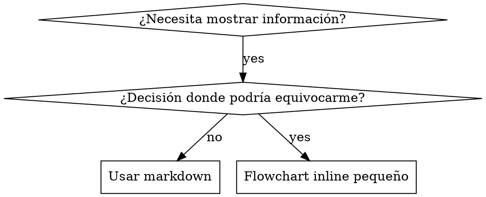

# Escribiendo Skills

## Visión General

**Escribir skills ES Desarrollo Guiado por Tests aplicado a documentación de procesos.**

**Las skills personales viven en directorios específicos de agente (`~/.claude/skills` para Claude Code, `~/.agents/skills/` para Codex)**

Escribes casos de test (escenarios de presión con subagentes), los ves fallar (comportamiento baseline), escribes la skill (documentación), ves los tests pasar (agentes cumplen), y refactorizas (cierras loopholes).

**Principio core:** Si no viste a un agente fallar sin la skill, no sabes si la skill enseña lo correcto.

**BACKGROUND REQUERIDO:** DEBES entender superpowers:test-driven-development antes de usar esta skill. Esa skill define el ciclo fundamental ROJO-VERDE-REFACTORIZAR. Esta skill adapta TDD a documentación.

**Guía oficial:** Para mejores prácticas oficiales de autoría de skills de Anthropic, ver anthropic-best-practices.md. Este documento provee patrones y guías adicionales que complementan el approach TDD en esta skill.

## ¿Qué es una Skill?

Una **skill** es una guía de referencia para técnicas, patrones o herramientas probadas. Las skills ayudan a futuras instancias de Claude a encontrar y aplicar approaches efectivos.

**Las skills son:** Técnicas reutilizables, patrones, herramientas, guías de referencia

**Las skills NO son:** Narrativas sobre cómo resolviste un problema una vez

## Mapeo de TDD para Skills

| Concepto TDD | Creación de Skills |
|-------------|-------------------|
| **Caso de test** | Escenario de presión con subagente |
| **Código de producción** | Documento de skill (SKILL.md) |
| **Test falla (ROJO)** | Agente viola regla sin skill (baseline) |
| **Test pasa (VERDE)** | Agente cumple con skill presente |
| **Refactorizar** | Cerrar loopholes manteniendo cumplimiento |
| **Escribir test primero** | Correr escenario baseline ANTES de escribir skill |
| **Mirarlo fallar** | Documentar racionalizaciones exactas que usa el agente |
| **Código mínimo** | Escribir skill abordando esas violaciones específicas |
| **Mirarlo pasar** | Verificar que el agente ahora cumple |
| **Ciclo de refactorizar** | Encontrar nueva racionalización → tapar → re-verificar |

Todo el proceso de creación de skills sigue ROJO-VERDE-REFACTORIZAR.

## Cuándo Crear una Skill

**Crear cuando:**
- La técnica no fue intuitivamente obvia para ti
- Harías referencia a esto de nuevo en otros proyectos
- El patrón aplica ampliamente (no específico de proyecto)
- Otros se beneficiarían

**No crear para:**
- Soluciones one-off
- Prácticas estándar bien documentadas en otros lados
- Convenciones específicas de proyecto (pon en CLAUDE.md)
- Restricciones mecánicas (si es enforceable con regex/validación, automatízalo — guarda documentación para decisiones de juicio)

## Tipos de Skills

### Técnica
Método concreto con pasos a seguir (condition-based-waiting, root-cause-tracing)

### Patrón
Forma de pensar sobre problemas (flatten-with-flags, test-invariants)

### Referencia
Documentación de API, guías de sintaxis, documentación de herramientas (office docs)

## Estructura de Directorios

```
skills/
  skill-name/
    SKILL.md              # Referencia principal (requerido)
    supporting-file.*     # Solo si se necesita
```

**Namespace plano** — todas las skills en un namespace searchable único

**Archivos separados para:**
1. **Referencia pesada** (100+ líneas) — docs de API, sintaxis comprehensiva
2. **Herramientas reutilizables** — Scripts, utilidades, plantillas

**Mantener inline:**
- Principios y conceptos
- Patrones de código (< 50 líneas)
- Todo lo demás

## Estructura de SKILL.md

**Frontmatter (YAML):**
- Dos campos requeridos: `name` y `description` (ver [agentskills.io/specification](https://agentskills.io/specification) para todos los campos soportados)
- Máximo 1024 caracteres totales
- `name`: Usar solo letras, números, e hyphens (sin paréntesis, caracteres especiales)
- `description`: Tercera persona, describe SOLO cuándo usar (NO qué hace)
  - Empezar con "Usar cuando..." para enfocar en condiciones de trigger
  - Incluir síntomas, situaciones, y contextos específicos
  - **NUNCA resumir el proceso o workflow de la skill** (ver sección CSO para por qué)
  - Mantener bajo 500 caracteres si es posible

```markdown
---
name: Skill-Name-With-Hyphens
description: Usar cuando [condiciones de trigger específicas y síntomas]
---

# Nombre de Skill

## Visión General
¿Qué es esto? Principio core en 1-2 oraciones.

## Cuándo Usar
[Flowchart inline pequeño SI la decisión no es obvia]

Bullet list con SÍNTOMAS y casos de uso
Cuándo NO usar

## Patrón Core (para técnicas/patrones)
Comparación de código antes/después

## Referencia Rápida
Tabla o bullets para escanear operaciones comunes

## Implementación
Código inline para patrones simples
Link a archivo para referencia pesada o herramientas reutilizables

## Errores Comunes
Qué sale mal + fixes

## Impacto Real (opcional)
Resultados concretos
```

## Optimización de Búsqueda para Claude (CSO)

**Crítico para descubrimiento:** Futuros Claude necesitan ENCONTRAR tu skill

### 1. Campo de Descripción Rico

**Propósito:** Claude lee la descripción para decidir qué skills cargar para una tarea dada. Hazla responder: "¿Debería leer esta skill ahora?"

**Formato:** Empezar con "Usar cuando..." para enfocar en condiciones de trigger

**CRÍTICO: Descripción = Cuándo Usar, NO Qué Hace la Skill**

La descripción debería SOLO describir condiciones de trigger. NO resumas el proceso o workflow de la skill en la descripción.

**Por qué importa:** Las pruebas revelaron que cuando una descripción resume el workflow de la skill, Claude puede seguir la descripción en lugar de leer el contenido completo de la skill. Una descripción diciendo "code review entre tareas" causó que Claude hiciera UNA revisión, aunque el flowchart de la skill mostraba claramente DOS revisiones (cumplimiento de especificación luego calidad de código).

Cuando la descripción fue cambiada a solo "Usar cuando ejecutando planes de implementación con tareas independientes" (sin resumen de workflow), Claude leyó correctamente el flowchart y siguió el proceso de revisión en dos etapas.

**La trampa:** Las descripciones que resumen workflow crean un atajo que Claude tomará. El cuerpo de la skill se convierte en documentación que Claude salta.

```yaml
# ❌ MAL: Resume workflow — Claude puede seguir esto en lugar de leer la skill
name: subagent-driven-development
description: Usar cuando ejecutando planes — despacha subagente por tarea con code review entre tareas

# ❌ MAL: Demasiado detalle de proceso
description: Usar para TDD — escribir test primero, mirarlo fallar, escribir código mínimo, refactorizar

# ✅ BIEN: Solo condiciones de trigger, sin resumen de workflow
description: Usar cuando ejecutando planes de implementación con tareas independientes en la sesión actual

# ✅ BIEN: Solo condiciones de trigger
description: Usar cuando implementando cualquier feature o bugfix, antes de escribir código de implementación
```

**Contenido:**
- Usar triggers concretos, síntomas, y situaciones que señalan que esta skill aplica
- Describir el *problema* (race conditions, comportamiento inconsistente) no *síntomas específicos de lenguaje* (setTimeout, sleep)
- Mantener triggers agnósticos de tecnología a menos que la skill misma sea específica de tecnología
- Si la skill es específica de tecnología, hazlo explícito en el trigger
- Escribir en tercera persona (inyectado en system prompt)
- **NUNCA resumir el proceso o workflow de la skill**

```yaml
# ❌ MAL: Demasiado abstracto, vago, no incluye cuándo usar
description: Para async testing

# ❌ MAL: Primera persona
description: Puedo ayudarte con tests async cuando son flaky

# ❌ MAL: Menciona tecnología pero skill no es específica de ella
description: Usar cuando tests usan setTimeout/sleep y son flaky

# ✅ BIEN: Empieza con "Usar cuando", describe problema, sin workflow
description: Usar cuando tests tienen race conditions, dependencias de timing, o pasan/fallan inconsistentemente

# ✅ BIEN: Skill específica de tecnología con trigger explícito
description: Usar cuando usando React Router y manejando authentication redirects
```

### 2. Cobertura de Keywords

Usar palabras que Claude buscaría:
- Mensajes de error: "Hook timed out", "ENOTEMPTY", "race condition"
- Síntomas: "flaky", "hanging", "zombie", "pollution"
- Sinónimos: "timeout/hang/freeze", "cleanup/teardown/afterEach"
- Herramientas: Comandos reales, nombres de librerías, tipos de archivo

### 3. Nombramiento Descriptivo

**Usar voz activa, verbo primero:**
- ✅ `creating-skills` no `skill-creation`
- ✅ `condition-based-waiting` no `async-test-helpers`

### 4. Eficiencia de Tokens (Crítico)

**Problema:** getting-started y skills frecuentemente referenciadas se cargan en CADA conversación. Cada token cuenta.

**Conteo objetivo de palabras:**
- Workflows getting-started: <150 palabras cada uno
- Skills frecuentemente cargadas: <200 palabras totales
- Otras skills: <500 palabras (aún ser conciso)

**Técnicas:**

**Mover detalles a help de herramienta:**
```bash
# ❌ MAL: Documentar todos los flags en SKILL.md
search-conversations soporta --text, --both, --after DATE, --before DATE, --limit N

# ✅ BIEN: Referenciar --help
search-conversations soporta múltiples modos y filtros. Ejecutar --help para detalles.
```

**Usar cross-references:**
```markdown
# ❌ MAL: Repetir detalles de workflow
Al buscar, despachar subagente con plantilla...
[20 líneas de instrucciones repetidas]

# ✅ BIEN: Referenciar otra skill
Siempre usar subagentes (ahorro de contexto 50-100x). REQUERIDO: Usar [other-skill-name] para workflow.
```

**Comprimir ejemplos:**
```markdown
# ❌ MAL: Ejemplo verboso (42 palabras)
tu socio humano: "¿Cómo manejamos errores de autenticación en React Router antes?"
Tú: Buscaré conversaciones pasadas por patrones de autenticación en React Router.
[Despachar subagente con query de búsqueda: "React Router authentication error handling 401"]

# ✅ BIEN: Ejemplo mínimo (20 palabras)
Partner: "¿Cómo manejamos auth errors en React Router?"
Tú: Buscando...
[Despachar subagente → síntesis]
```

**Eliminar redundancia:**
- No repetir lo que está en skills cross-referenciadas
- No explicar lo que es obvio del comando
- No incluir múltiples ejemplos del mismo patrón

**Verificación:**
```bash
wc -w skills/path/SKILL.md
# Workflows getting-started: apuntar a <150 cada uno
# Otras frecuentemente cargadas: apuntar a <200 totales
```

**Nombrar por lo que HACES o insight core:**
- ✅ `condition-based-waiting` > `async-test-helpers`
- ✅ `using-skills` no `skill-usage`
- ✅ `flatten-with-flags` > `data-structure-refactoring`
- ✅ `root-cause-tracing` > `debugging-techniques`

**Gerundios (-ing) funcionan bien para procesos:**
- `creating-skills`, `testing-skills`, `debugging-with-logs`
- Activos, describen la acción que estás tomando

### 4. Cross-Referenciando Otras Skills

**Al escribir documentación que referencia otras skills:**

Usar solo nombre de skill, con marcadores explícitos de requerimiento:
- ✅ Bueno: `**SUB-SKILL REQUERIDO:** Usar superpowers:test-driven-development`
- ✅ Bueno: `**BACKGROUND REQUERIDO:** DEBES entender superpowers:systematic-debugging`
- ❌ Malo: `Ver skills/testing/test-driven-development` (no claro si requerido)
- ❌ Malo: `@skills/testing/test-driven-development/SKILL.md` (force-load, quema contexto)

**Por qué no links @:** La sintaxis `@` force-loada archivos inmediatamente, consumiendo 200k+ de contexto antes de necesitarlos.

## Uso de Flowcharts



**Usar flowcharts SOLO para:**
- Puntos de decisión no obvios
- Loops de proceso donde podrías detenerte demasiado temprano
- Decisiones "cuándo usar A vs B"

**Nunca usar flowcharts para:**
- Material de referencia → Tablas, listas
- Ejemplos de código → Bloques markdown
- Instrucciones lineales → Listas numeradas
- Labels sin significado semántico (step1, helper2)

Ver @graphviz-conventions.dot para reglas de estilo graphviz.

**Visualización para tu socio humano:** Usa `render-graphs.js` en este directorio para renderizar flowcharts de una skill a SVG:
```bash
./render-graphs.js ../some-skill           # Cada diagrama separadamente
./render-graphs.js ../some-skill --combine # Todos los diagramas en un SVG
```

## Ejemplos de Código

**Un excelente ejemplo vence a muchos mediocres**

Elegir lenguaje más relevante:
- Técnicas de testing → TypeScript/JavaScript
- Debugging de sistemas → Shell/Python
- Procesamiento de datos → Python

**Buen ejemplo:**
- Completo y ejecutable
- Bien comentado explicando POR QUÉ
- De escenario real
- Muestra el patrón claramente
- Listo para adaptar (no plantilla genérica)

**No hacer:**
- Implementar en 5+ lenguajes
- Crear plantillas de rellenar-blancos
- Escribir ejemplos forzados

Eres bueno portando — un gran ejemplo es suficiente.

## Organización de Archivos

### Skill Autocontenida
```
defense-in-depth/
  SKILL.md    # Todo inline
```
Cuándo: Todo el contenido cabe, no se necesita referencia pesada

### Skill con Herramienta Reutilizable
```
condition-based-waiting/
  SKILL.md    # Visión general + patrones
  example.ts  # Helpers funcionales para adaptar
```
Cuándo: La herramienta es código reutilizable, no solo narrativa

### Skill con Referencia Pesada
```
pptx/
  SKILL.md       # Visión general + workflows
  pptxgenjs.md   # 600 líneas de referencia de API
  ooxml.md       # 500 líneas de estructura XML
  scripts/       # Herramientas ejecutables
```
Cuándo: Material de referencia demasiado grande para inline

## La Ley de Hierro (Igual que TDD)

```
NO SKILL SIN UN TEST FALLANDO PRIMERO
```

Esto aplica a skills NUEVAS Y EDICIONES a skills existentes.

¿Escribiste skill antes de testear? Bórrala. Empieza de nuevo.
¿Editaste skill sin testear? Misma violación.

**Sin excepciones:**
- No para "adiciones simples"
- No para "solo agregar una sección"
- No para "actualizaciones de documentación"
- No guardes cambios no testeados como "referencia"
- No "adaptes" mientras corres tests
- Borrar significa borrar

**BACKGROUND REQUERIDO:** La skill superpowers:test-driven-development explica por qué esto importa. Los mismos principios aplican a documentación.

## Testeando Todos los Tipos de Skills

Diferentes tipos de skills necesitan diferentes approaches de test:

### Skills de Disciplina (reglas/requisitos)

**Ejemplos:** TDD, verification-before-completion, designing-before-coding

**Testear con:**
- Preguntas académicas: ¿Entienden las reglas?
- Escenarios de presión: ¿Cumplen bajo estrés?
- Múltiples presiones combinadas: tiempo + sunk cost + agotamiento
- Identificar racionalizaciones y agregar contra-argumentos explícitos

**Criterios de éxito:** Agente sigue la regla bajo presión máxima

### Skills de Técnica (guías how-to)

**Ejemplos:** condition-based-waiting, root-cause-tracing, defensive-programming

**Testear con:**
- Escenarios de aplicación: ¿Pueden aplicar la técnica correctamente?
- Escenarios de variación: ¿Manejan edge cases?
- Tests de información faltante: ¿Las instrucciones tienen gaps?

**Criterios de éxito:** Agente aplica técnica exitosamente a nuevo escenario

### Skills de Patrón (modelos mentales)

**Ejemplos:** reducing-complexity, information-hiding concepts

**Testear con:**
- Escenarios de reconocimiento: ¿Reconocen cuándo aplica el patrón?
- Escenarios de aplicación: ¿Pueden usar el modelo mental?
- Contra-ejemplos: ¿Saben cuándo NO aplicar?

**Criterios de éxito:** Agente identifica correctamente cuándo/cómo aplicar patrón

### Skills de Referencia (documentación/APIs)

**Ejemplos:** Documentación de API, referencias de comando, guías de librerías

**Testear con:**
- Escenarios de recuperación: ¿Pueden encontrar la información correcta?
- Escenarios de aplicación: ¿Pueden usar lo que encontraron correctamente?
- Testeo de gaps: ¿Están cubiertos los casos de uso comunes?

**Criterios de éxito:** Agente encuentra y aplica correctamente información de referencia

## Racionalizaciones Comunes para Saltar Testing

| Excusa | Realidad |
|--------|---------|
| "La skill es obviamente clara" | Claro para ti ≠ claro para otros agentes. Testéala. |
| "Es solo referencia" | Las referencias pueden tener gaps, secciones poco claras. Testear recuperación. |
| "Testear es exagerado" | Skills no testeadas tienen issues. Siempre. 15 min de testing ahorra horas. |
| "Testearé si surgen problemas" | Problemas = agentes no pueden usar la skill. Testear ANTES de deploy. |
| "Demasiado tedioso testear" | Testear es menos tedioso que debuggear skills malas en producción. |
| "Estoy confiado de que está bien" | Sobreconfianza garantiza issues. Testear de todas formas. |
| "Revisión académica es suficiente" | Leer ≠ usar. Testear escenarios de aplicación. |
| "No hay tiempo para testear" | Deployar skill no testeado desperdicia más tiempo arreglándola después. |

**Todo esto significa: Testear antes de deploy. Sin excepciones.**

## Blindando Skills Contra Racionalización

Las skills que imponen disciplina (como TDD) necesitan resistir racionalización. Los agentes son inteligentes y encontrarán loopholes bajo presión.

**Nota de psicología:** Entender POR QUÉ las técnicas de persuasión funcionan te ayuda a aplicarlas sistemáticamente. Ver persuasion-principles.md para fundamento de investigación (Cialdini, 2021; Meincke et al., 2025) sobre principios de autoridad, compromiso, escasez, social proof, y unidad.

### Cerrar Cada Loophole Explícitamente

No solo enunciar la regla — prohibir workarounds específicos:

<Bad>
```markdown
¿Escribiste código antes del test? Bórralo.
```
</Bad>

<Good>
```markdown
¿Escribiste código antes del test? Bórralo. Empieza de nuevo.

**Sin excepciones:**
- No lo guardes como "referencia"
- No lo "adaptes" mientras escribes tests
- No lo mires
- Borrar significa borrar
```
</Good>

### Abordar Argumentos de "Espíritu vs Letra"

Agregar principio foundational temprano:

```markdown
**Violando la letra de las reglas se viola el espíritu de las reglas.**
```

Esto corta toda una clase de racionalizaciones "estoy siguiendo el espíritu".

### Construir Tabla de Racionalización

Capturar racionalizaciones del testing baseline (ver sección Testing abajo). Cada excusa que los agentes hacen va en la tabla:

```markdown
| Excusa | Realidad |
|--------|---------|
| "Demasiado simple para testear" | Código simple se rompe. Test toma 30 segundos. |
| "Testearé después" | Tests pasando inmediatamente no prueban nada. |
| "Tests después logran las mismas metas" | Tests-after = "¿qué hace esto?" Tests-first = "¿qué debería hacer esto?" |
```

### Crear Lista de Red Flags

Hacer fácil que los agentes se auto-chequeen cuando racionalizan:

```markdown
## Red Flags — DETENTE y Empieza de Nuevo

- Código antes del test
- "Ya lo testeé manualmente"
- "Tests después logran el mismo propósito"
- "Es sobre espíritu no ritual"
- "Esto es diferente porque..."

**Todo esto significa: Borra el código. Empieza de nuevo con TDD.**
```

### Actualizar CSO para Síntomas de Violación

Agregar a descripción: síntomas de cuándo estás POR violar la regla:

```yaml
description: usar cuando implementando cualquier feature o bugfix, antes de escribir código de implementación
```

## ROJO-VERDE-REFACTORIZAR para Skills

Seguir el ciclo TDD:

### ROJO: Escribir Test Fallando (Baseline)

Correr escenario de presión con subagente SIN la skill. Documentar comportamiento exacto:
- ¿Qué elecciones hicieron?
- ¿Qué racionalizaciones usaron (verbatim)?
- ¿Qué presiones triggeraron violaciones?

Esto es "mirar el test fallar" — debes ver qué hacen los agentes naturalmente antes de escribir la skill.

### VERDE: Escribir Skill Mínima

Escribir skill que aborde esas racionalizaciones específicas. No agregar contenido extra para casos hipotéticos.

Correr mismos escenarios CON la skill. El agente debería cumplir ahora.

### REFACTORIZAR: Cerrar Loopholes

¿El agente encontró nueva racionalización? Agregar contra explícito. Re-testear hasta que sea a prueba de balas.

**Metodología de testing:** Ver @testing-skills-with-subagents.md para la metodología completa de testing:
- Cómo escribir escenarios de presión
- Tipos de presión (tiempo, sunk cost, autoridad, agotamiento)
- Tapando agujeros sistemáticamente
- Técnicas de meta-testing

## Anti-Patrones

### ❌ Ejemplo Narrativo
"En sesión 2025-10-03, encontramos que projectDir vacío causó..."
**Por qué malo:** Demasiado específico, no reutilizable

### ❌ Dilución Multi-Lenguaje
example-js.js, example-py.py, example-go.go
**Por qué malo:** Calidad mediocre, carga de mantenimiento

### ❌ Código en Flowcharts
```dot
step1 [label="import fs"];
step2 [label="read file"];
```
**Por qué malo:** No se puede copiar-pegar, difícil de leer

### ❌ Labels Genéricos
helper1, helper2, step3, pattern4
**Por qué malo:** Los labels deberían tener significado semántico

## DETENTE: Antes de Pasar a Siguiente Skill

**Después de escribir CUALQUIER skill, DEBES DETENERTE y completar el proceso de deployment.**

**NO:**
- Crear múltiples skills en batch sin testear cada una
- Pasar a siguiente skill antes de que la actual esté verificada
- Saltar testing porque "batching es más eficiente"

**El checklist de deployment abajo es OBLIGATORIO para CADA skill.**

Deployar skills no testeadas = deployar código no testeado. Es una violación de estándares de calidad.

## Checklist de Creación de Skills (TDD Adaptado)

**IMPORTANTE: Usar TodoWrite para crear todos para CADA item de checklist abajo.**

**Fase ROJO — Escribir Test Fallando:**
- [ ] Crear escenarios de presión (3+ presiones combinadas para skills de disciplina)
- [ ] Correr escenarios SIN skill — documentar comportamiento baseline verbatim
- [ ] Identificar patrones en racionalizaciones/fallas

**Fase VERDE — Escribir Skill Mínima:**
- [ ] Nombre usa solo letras, números, hyphens (sin paréntesis/caracteres especiales)
- [ ] YAML frontmatter con campos requeridos `name` y `description` (máx 1024 chars; ver [spec](https://agentskills.io/specification))
- [ ] Descripción empieza con "Usar cuando..." e incluye triggers/síntomas específicos
- [ ] Descripción escrita en tercera persona
- [ ] Keywords a lo largo para búsqueda (errores, síntomas, herramientas)
- [ ] Visión general clara con principio core
- [ ] Abordar fallas baseline específicas identificadas en ROJO
- [ ] Código inline O link a archivo separado
- [ ] Un excelente ejemplo (no multi-lenguaje)
- [ ] Correr escenarios CON skill — verificar que agentes ahora cumplen

**Fase REFACTORIZAR — Cerrar Loopholes:**
- [ ] Identificar NUEVAS racionalizaciones del testing
- [ ] Agregar contra-argumentos explícitos (si skill de disciplina)
- [ ] Construir tabla de racionalización de todas las iteraciones de test
- [ ] Crear lista de red flags
- [ ] Re-testear hasta que sea a prueba de balas

**Chequeos de Calidad:**
- [ ] Flowchart pequeño solo si decisión no obvia
- [ ] Tabla de referencia rápida
- [ ] Sección de errores comunes
- [ ] Sin narrativa storytelling
- [ ] Archivos de soporte solo para herramientas o referencia pesada

**Deployment:**
- [ ] Commitear skill a git y pushear a tu fork (si configurado)
- [ ] Considerar contribuir de vuelta vía PR (si útil ampliamente)

## Workflow de Descubrimiento

Cómo futuros Claude encuentran tu skill:

1. **Encuentra problema** ("los tests son flaky")
3. **Encuentra SKILL** (la descripción coincide)
4. **Escanea visión general** (¿es esto relevante?)
5. **Lee patrones** (tabla de referencia rápida)
6. **Carga ejemplo** (solo cuando implementando)

**Optimiza para este flujo** — pon términos searchable temprano y frecuentemente.

## La Línea de Fondo

**Crear skills ES TDD para documentación de procesos.**

Misma Ley de Hierro: No skill sin test fallando primero.
Mismo ciclo: ROJO (baseline) → VERDE (escribir skill) → REFACTORIZAR (cerrar loopholes).
Mismos beneficios: Mejor calidad, menos sorpresas, resultados a prueba de balas.

Si sigues TDD para código, síguelo para skills. Es la misma disciplina aplicada a documentación.
