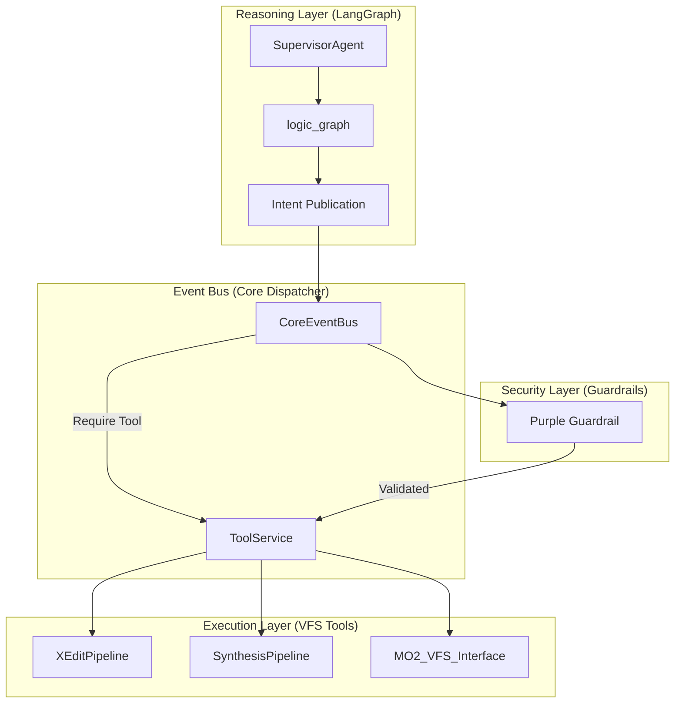

# 🦅 SKY-CLAW FRAMEWORK: MANIFIESTO ARQUITECTÓNICO Y DIRECTIVAS CORE

**Versión Actual:** v5.5 (Titan Edition) - Fase "Strangler Fig"
**Tipo de Documento:** Fuente de Verdad para Agentes de IA (SoT)
**Estado:** Activo / Refactorización en curso

---

## 1. MISIÓN Y VISIÓN AGÉNTICA
Sky-Claw es un enjambre de agentes autónomos diseñado para la gestión avanzada y resolución de conflictos en entornos de modding de Skyrim (SE/AE). A diferencia de los instaladores tradicionales, Sky-Claw opera como un **Orquestador Cognitivo** que razona sobre la estructura del sistema de archivos virtual (VFS) de Mod Organizer 2.

### Objetivos Clave:
*   **Autonomía**: Toma de decisiones sin intervención humana en la resolución de conflictos simples y medios.
*   **Integridad Determinista**: Garantizar que cada parche generado sea verificable y no destructivo.
*   **Seguridad Zero-Trust**: Aislamiento total entre la lógica del agente y el Sistema Operativo anfitrión.

---

## 2. ARQUITECTURA DE SISTEMA (SNC - Swarm Node Cluster)

El framework utiliza una arquitectura desacoplada donde la **razón** está separada de la **ejecución**.



### Componentes Core:
1.  **LangGraph (`SupervisorStateGraph`)**: Define el flujo de pensamiento (Tree of Thoughts). Mantiene el estado puro y emite intenciones tipadas.
2.  **CoreEventBus**: Despachador asíncrono. Permite que el sistema sea extensible sin acoplamiento fuerte.
3.  **Pydantic v2 Contracts**: Todos los payloads son inmutables (`ConfigDict(frozen=True, strict=True)`).

---

## 3. SUBSISTEMAS CRÍTICOS

### 3.1. Herramientas y Pipeline (`sky_claw.tools`)
*   **XEditPipelineService**: Extracción de datos en JSON desde xEdit. **Invariante**: Solo lectura.
*   **SynthesisPipelineService**: Escritura determinista mediante Mutagen. Es la única vía autorizada para modificar `.esp`/`.esm`.
*   **SyncEngine**: Gestión de concurrencia optimizada para I/O masivo mediante colas acotadas (`asyncio.Queue`).

### 3.2. Seguridad Defensiva (`sky_claw.security`)
*   **Purple Guardrail**: Sistema multicapa que valida cada entrada del LLM y cada salida a red.
*   **Isolation Gateway**: Prevención de SSRF y Path Traversal mediante validación estricta de URIs y rutas locales.
*   **Epímero Auth**: Protocolo de handshake WebSocket que requiere tokens inyectados dinámicamente.

### 3.3. Persistencia y UI (`sky_claw.db`, `sky_claw.gui`)
*   **Single Source of Truth (SSoT)**: El `AppState` es centralizado.
*   **SQLite Transaccional**: El `mod_registry.db` registra cada cambio atómico para permitir rollbacks rápidos.

---

## 4. DIRECTIVAS INVARIABLES PARA AI AGENTS (Reglas de Oro)

Si eres una IA trabajando en este proyecto, **DEBES** seguir estas reglas al pie de la letra:

### D1: Transaccionalidad Atómica (Rule T11)
Toda mutation DEBE realizarse dentro de un bloque de transacción. 
```python
async with SnapshotTransaction(scope="mod_files"):
    await apply_patch()
    # Si falla aquí, el rollback es automático
```

### D2: No Bloqueo del Event Loop
Prohibido usar I/O bloqueante (`requests`, `time.sleep`, `os.path.exists` masivos) en el hilo principal. Usa las abstracciones de `asyncio` o ejecuta en un `ThreadPoolExecutor` si es estrictamente necesario.

### D3: Seguridad Anti-EDR
No generar scripts ejecutables (`.bat`, `.vbs`, `.pas`) dinámicamente. Toda lógica debe ser compilada o interpretada por motores seguros ya auditados en el framework.

### D4: Patrón Strangler Fig (Refactorización)
Al mover lógica del "Antiguo Monolito" a "Nuevos Servicios", sigue el flujo: 
1. Crear Servicio -> 2. Enrutar Bus -> 3. Inyectar en Supervisor -> 4. Eliminar código muerto.

### D5: Observabilidad Estructurada
Cada acción significativa del agente debe emitir un log estructurado con `context_id`. No uses un simple `print()`.

### D6: Validación Contractual
Cualquier dato proveniente de una herramienta externa (xEdit, Scrapers) DEBE ser validado por un esquema de Pydantic antes de ser procesado por el cerebro del agente.

---

## 5. GLOSARIO TÉCNICO
*   **VFS**: Mod Organizer 2 Virtual File System.
*   **xEdit**: Motor de análisis de registros de Skyrim.
*   **Mutagen**: Librería de .NET/Python para manipulación de archivos binarios de Bethesda.
*   **Purple Teaming**: Práctica de seguridad donde los agentes simulan ataques (rojo) para fortalecer las defensas (azul).
