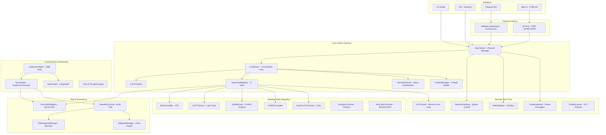
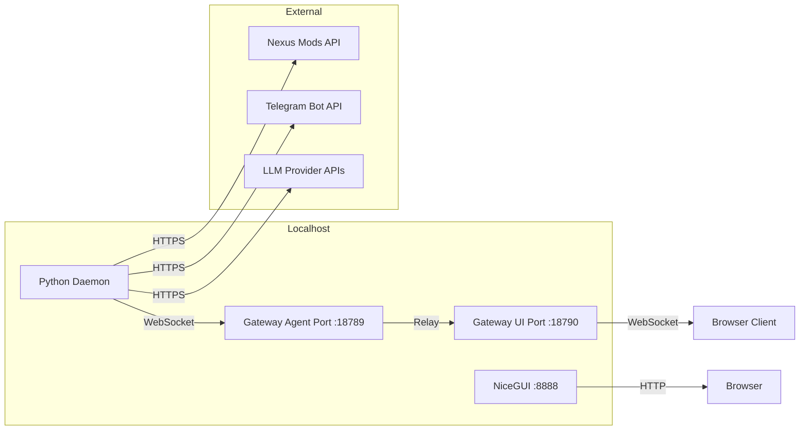
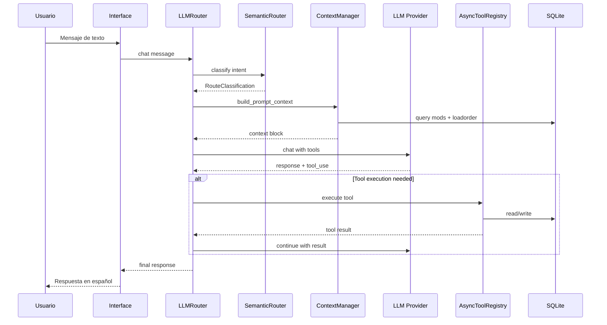
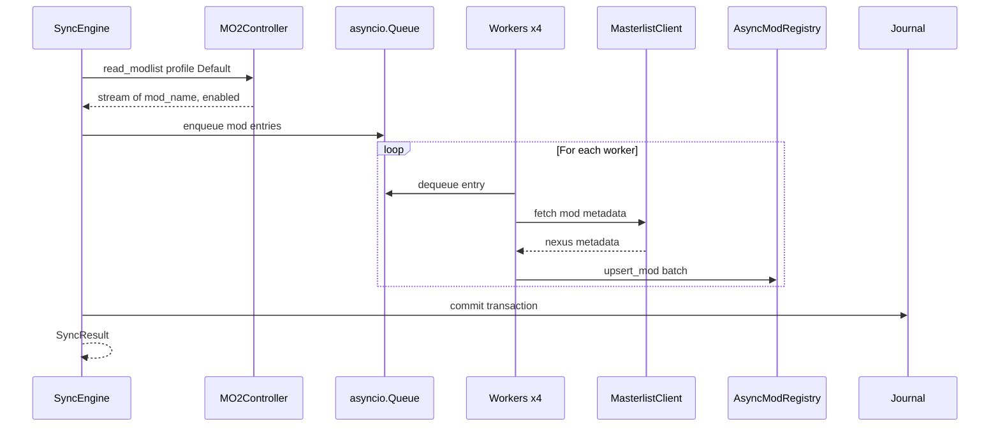
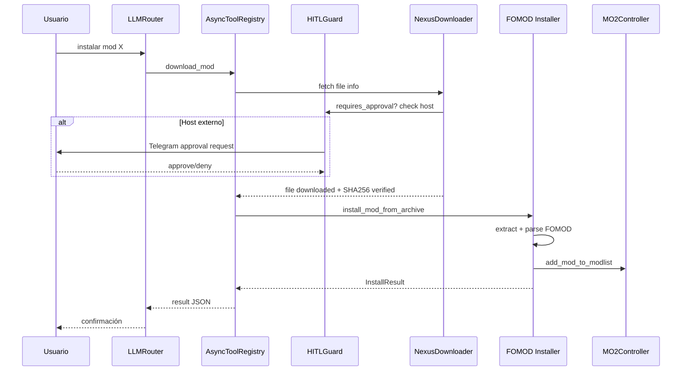
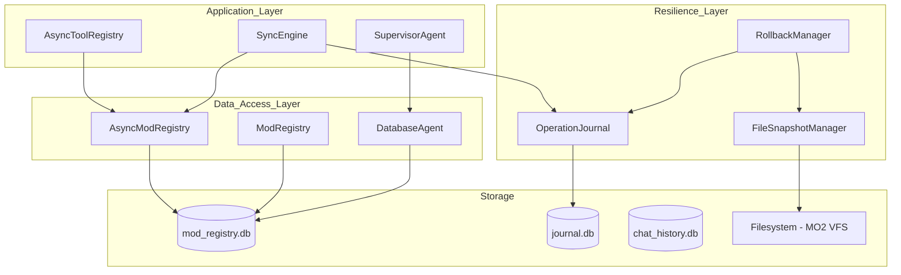
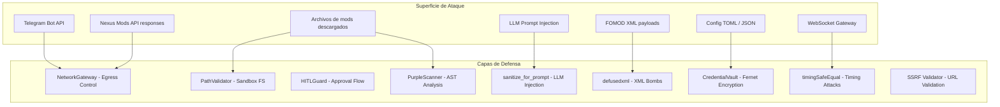

# 📐 Análisis Arquitectónico Exhaustivo — Sky-Claw

**Fecha:** 2026-04-11  
**Versión Analizada:** 0.1.0 (Build 1.4.26.16.32)  
**Auditor:** Architect Mode — Roo AI  
**Alcance:** Análisis completo de arquitectura, seguridad, rendimiento, deuda técnica y flujos de datos

---

## 1. Resumen Ejecutivo

### Qué es Sky-Claw

Sky-Claw es un **agente autónomo avanzado de gestión de mods para Skyrim SE/AE** que opera a través de Mod Organizer 2 (MO2). Permite buscar, descargar, instalar y resolver conflictos de mods usando lenguaje natural, con soporte multi-LLM y múltiples interfaces de usuario.

### Propósito y Alcance

| Dimensión | Detalle |
|-----------|---------|
| **Dominio** | Modding de Skyrim Special/Anniversary Edition |
| **Objetivo** | Automatizar el ciclo completo de gestión de mods: búsqueda → descarga → instalación → resolución de conflictos → generación de LODs |
| **Complejidad** | ~15,000+ líneas de Python, ~650 líneas de Node.js, ~40 módulos, 7 capas arquitectónicas |
| **Interfaces** | CLI, GUI (NiceGUI), Telegram Bot, Web UI (HTML/JS) |
| **LLMs** | Anthropic Claude, OpenAI/GPT-4, DeepSeek, Ollama (local) |

### Métricas del Proyecto

| Métrica | Valor |
|---------|-------|
| Módulos Python | ~40 paquetes/sub-paquetes |
| Archivos de código fuente | ~120+ |
| Tests | ~30 archivos de test |
| Herramientas externas integradas | 8 (LOOT, xEdit, DynDOLOD, Synthesis, Wrye Bash, Pandora, BodySlide, TexGen) |
| Bases de datos SQLite | 4+ (mod_registry, chat_history, journal, vault) |
| Gateway Node.js | 2 servidores WebSocket (agent + UI) |

---

## 2. Arquitectura del Sistema

### Diagrama de Componentes Principales



### Diagrama de Puertos y Conexiones



---

## 3. Stack Tecnológico Completo

### Lenguajes y Runtimes

| Componente | Lenguaje | Runtime | Versión |
|------------|----------|---------|---------|
| Daemon principal | Python | CPython | 3.14+ |
| Gateway WebSocket | JavaScript | Node.js | 24+ |
| Frontend Web | HTML/CSS/JS | Browser | N/A |
| Scripts Pascal | Pascal | xEdit | N/A |
| Scripts PowerShell | PowerShell | Windows | 5.1+ |

### Frameworks y Librerías Python

| Categoría | Librería | Versión | Propósito |
|-----------|----------|---------|-----------|
| **Async I/O** | `aiohttp` | 3.13.3+ | HTTP client/server async |
| **Async I/O** | `aiosqlite` | 0.19+ | SQLite async wrapper |
| **Async I/O** | `aiofiles` | 24.1+ | File I/O async |
| **WebSocket** | `websockets` | 14.0+ | WS client para Gateway |
| **Validación** | `pydantic` | 2.0+ | Schema validation, models |
| **Criptografía** | `cryptography` | 41.0+ | Fernet encryption, PBKDF2 |
| **Seguridad** | `defusedxml` | 0.7.1+ | XML bomb prevention en FOMOD |
| **Retry** | `tenacity` | 9.1+ | Exponential backoff |
| **GUI** | `nicegui` | N/A | Web-based GUI framework |
| **GUI Legacy** | `sv-ttk` | 2.5+ | Tkinter dark theme |
| **Keyring** | `keyring` | 24.0+ | OS credential storage |
| **Procesos** | `psutil` | 5.8+ | Process monitoring |
| **Logging** | `python-json-logger` | 2.0+ | Structured JSON logging |
| **Config** | `tomli-w` | 1.0+ | TOML writer |
| **Testing** | `pytest` | 7.4+ | Test framework |
| **Testing** | `pytest-asyncio` | 1.0+ | Async test support |

### Librerías Node.js (Gateway)

| Librería | Versión | Propósito |
|----------|---------|-----------|
| `ws` | 8.16+ | WebSocket server |
| `grammy` | 1.21+ | Telegram Bot framework |
| `playwright` | 1.49+ | Headless browser automation |
| `dotenv` | 16.4+ | Environment variables |

### APIs Externas

| API | Protocolo | Propósito |
|-----|-----------|-----------|
| Nexus Mods REST API v1 | HTTPS/REST | Metadata de mods, descargas |
| Telegram Bot API | HTTPS/Long Poll | Interacción con usuario |
| Anthropic Messages API | HTTPS/REST | LLM Claude |
| OpenAI Chat Completions | HTTPS/REST | LLM GPT-4 |
| DeepSeek Chat API | HTTPS/REST | LLM DeepSeek |
| Ollama Local API | HTTP/REST | LLM local |

---

## 4. Módulos Críticos — Análisis Detallado

### 4.1 [`sky_claw/app_context.py`](sky_claw/app_context.py) — Orquestador de Lifecycle

**Responsabilidad:** Gestión del ciclo de vida completo de la aplicación. Inicializa y coordina todos los subsistemas.

**Dependencias:** Prácticamente todos los módulos del proyecto.

**Complejidad:** 443 líneas, 2 fases de inicialización (`start_minimal` + `start_full`).

**Riesgos:**
- Acoplamiento fuerte: importa ~20 módulos directamente
- La inicialización es secuencial y monolítica
- Si `start_full` falla a mitad de camino, queda en estado parcial

### 4.2 [`sky_claw/agent/router.py`](sky_claw/agent/router.py) — Router de Conversación LLM

**Responsabilidad:** Loop de conversación con el LLM, ejecución de tools, historial en SQLite.

**Dependencias:** `providers`, `tools_facade`, `semantic_router`, `context_manager`, `lcel_chains`, `credential_vault`.

**Complejidad:** 418 líneas, gestiona historial con sliding window de 20 mensajes.

**Patrones:**
- Tool execution loop con máximo 10 rondas (`MAX_TOOL_ROUNDS`)
- Validación de API keys con detección de placeholders
- Provider swapping con lock asíncrono

### 4.3 [`sky_claw/agent/providers.py`](sky_claw/agent/providers.py) — Proveedores LLM

**Responsabilidad:** Abstracción multi-backend para LLMs (Anthropic, DeepSeek, Ollama).

**Complejidad:** 338 líneas, 4 providers concretos.

**Patrones:**
- Strategy Pattern con `LLMProvider` abstract base
- Retry con `tenacity` (exponential backoff, max 5 intentos)
- Factory function `create_provider()`
- Normalización de respuestas a formato interno común

### 4.4 [`sky_claw/orchestrator/supervisor.py`](sky_claw/orchestrator/supervisor.py) — Agente Supervisor

**Responsabilidad:** Coordinación de todos los sub-agentes (scraper, tools, interface, database).

**Complejidad:** **1588 líneas** — el módulo más grande del proyecto.

**Dependencias:** Importa de ~15 módulos diferentes.

**Riesgos:**
- Tamaño excesivo: viola SRP (Single Responsibility Principle)
- Acumula responsabilidades de 6 fases de desarrollo
- Difícil de testear unitariamente

### 4.5 [`sky_claw/orchestrator/sync_engine.py`](sky_claw/orchestrator/sync_engine.py) — Motor de Sincronización

**Responsabilidad:** Sincronización producer-consumer entre MO2 y la base de datos de mods.

**Complejidad:** 751 líneas.

**Patrones:**
- Producer-Consumer con `asyncio.Queue`
- Worker pool configurable (4 workers por defecto)
- Micro-batching para escrituras SQLite
- Integración con RollbackManager para operaciones atómicas

### 4.6 [`sky_claw/security/network_gateway.py`](sky_claw/security/network_gateway.py) — Gateway de Red

**Responsabilidad:** Control de egreso para todo tráfico HTTP. Allow-list de dominios.

**Complejidad:** 245 líneas.

**Patrones:**
- Domain allow-list (`*.nexusmods.com`, `api.telegram.org`)
- Private IP blocking (SSRF prevention)
- Custom `SafeResolver` para prevenir DNS rebinding
- Custom `GatewayTCPConnector` con SSL estricto

### 4.7 [`sky_claw/db/journal.py`](sky_claw/db/journal.py) — Sistema de Journaling

**Responsabilidad:** Registro durable de operaciones de archivos para rollback completo.

**Complejidad:** 873 líneas.

**Patrones:**
- Transaction grouping con estados (PENDING → COMMITTED → ROLLED_BACK)
- Jerarquía de excepciones propia
- Snapshot automático antes de modificaciones

### 4.8 [`sky_claw/xedit/runner.py`](sky_claw/xedit/runner.py) — Ejecutor xEdit Headless

**Responsabilidad:** Ejecución asíncrona de scripts Pascal via SSEEdit en modo headless.

**Complejidad:** 1039 líneas.

**Patrones:**
- Validación regex de nombres de script y plugins
- Dynamic Pascal script generation
- Timeout configurable con cleanup de procesos

### 4.9 [`sky_claw/tools/dyndolod_runner.py`](sky_claw/tools/dyndolod_runner.py) — Pipeline DynDOLOD/TexGen

**Responsabilidad:** Generación automatizada de LODs con empaquetado para MO2.

**Complejidad:** 981 líneas.

**Patrones:**
- Pipeline multi-etapa (TexGen → DynDOLOD → empaquetado)
- Validación de output post-ejecución
- Timeout específico por herramienta

### 4.10 [`sky_claw/reasoning/engine.py`](sky_claw/reasoning/engine.py) — Motor Tree-of-Thought

**Responsabilidad:** Razonamiento avanzado con búsqueda en árbol de pensamientos.

**Complejidad:** 637 líneas + 500 líneas de estrategias.

**Estrategias implementadas:** BFS, DFS, Best-First, Beam Search, MCTS (Monte Carlo Tree Search).

---

## 5. Flujos de Datos

### 5.1 Flujo de Chat (Usuario → Respuesta)



### 5.2 Flujo de Sincronización (MO2 → Database)



### 5.3 Flujo de Instalación de Mod con HITL



---

## 6. Integraciones Externas

### 6.1 Nexus Mods API

| Aspecto | Detalle |
|---------|---------|
| **Endpoint** | `https://api.nexusmods.com/v1/games/skyrimspecialedition/` |
| **Auth** | API Key header |
| **Rate Limit** | Circuit Breaker (5 failures → OPEN, 60s recovery) |
| **Operaciones** | Metadata fetch, file info, download URL generation |
| **Validación** | SHA256 hash verification post-download |

### 6.2 Telegram Bot API

| Aspecto | Detalle |
|---------|---------|
| **Modo** | Long Polling (desarrollo) + Webhook (producción) |
| **Framework** | Grammy (Node.js gateway) + aiohttp (Python) |
| **Auth** | Bot Token + Chat ID autorizado |
| **HITL** | Inline keyboard buttons para approve/deny |
| **Formato** | HTML parse mode para mensajes |

### 6.3 LOOT (Load Order Optimization Tool)

| Aspecto | Detalle |
|---------|---------|
| **Ejecución** | CLI headless via subprocess |
| **Args** | `--game SkyrimSE --game-path --sort --update-masterlist` |
| **Timeout** | 60s configurable |
| **Output** | Parseado por `LOOTOutputParser` |

### 6.4 xEdit / SSEEdit

| Aspecto | Detalle |
|---------|---------|
| **Ejecución** | Headless via subprocess con scripts Pascal |
| **Scripts** | `list_all_conflicts.pas`, `apply_leveled_list_merge.pas` |
| **Flags** | `-IKnowWhatImDoing` para escritura |
| **Timeout** | 120s configurable |
| **Validación** | Regex estricto para nombres de script y plugins |

### 6.5 DynDOLOD / TexGen

| Aspecto | Detalle |
|---------|---------|
| **Pipeline** | TexGen → DynDOLOD → Empaquetado MO2 |
| **Ejecución** | Via VFS Orchestrator de MO2 (`-m` flag) |
| **Timeout** | 3600s (1 hora) por defecto |
| **Output** | Validación de archivos .esp y textures generados |

### 6.6 Otras Herramientas

| Herramienta | Módulo | Propósito |
|-------------|--------|-----------|
| Synthesis | `synthesis_runner.py` | Pipeline de patchers |
| Wrye Bash | `wrye_bash_runner.py` | Bashed Patch generation |
| Pandora | `pandora_runner.py` | Behavior Engine animations |
| BodySlide | `bodyslide_runner.py` | Body/physics mesh generation |

---

## 7. Gestión de Estado y Persistencia

### 7.1 Bases de Datos SQLite

| Base de Datos | Propósito | Modo |
|---------------|-----------|------|
| `mod_registry.db` | Registry principal de mods | WAL, async |
| `*_history.db` | Historial de chat por sesión | WAL |
| `journal.db` | Audit trail de operaciones | WAL |
| `sky_claw_state.db` | Estado del scraper, agent memory, GUI | WAL |

### 7.2 Capas de Persistencia



### 7.3 Configuración

| Mecanismo | Ubicación | Propósito |
|-----------|-----------|-----------|
| `config.toml` | `~/.sky_claw/config.toml` | Configuración principal |
| `sky_claw_config.json` | CWD (legacy) | Config legacy con migración |
| OS Keyring | Windows Credential Manager | API keys, tokens |
| `CredentialVault` | SQLite + Fernet | Secretos encriptados |
| Environment vars | `SKY_CLAW_*` | Overrides de configuración |

---

## 8. Patrones de Diseño Identificados

| Patrón | Implementación | Módulo |
|--------|---------------|--------|
| **Strategy** | `LLMProvider` ABC con múltiples implementaciones | `agent/providers.py` |
| **Facade** | `AsyncToolRegistry` como fachada de 17 tools | `agent/tools_facade.py` |
| **Circuit Breaker** | `_CircuitBreaker` con estados CLOSED/OPEN/HALF-OPEN | `scraper/masterlist.py` |
| **Producer-Consumer** | `SyncEngine` con `asyncio.Queue` y worker pool | `orchestrator/sync_engine.py` |
| **Journal** | `OperationJournal` para audit trail y rollback | `db/journal.py` |
| **Snapshot** | `FileSnapshotManager` para backup pre-modificación | `db/snapshot_manager.py` |
| **Memento** | `RollbackManager` para restaurar estado anterior | `db/rollback_manager.py` |
| **Gateway** | `NetworkGateway` como middleware obligatorio de egreso | `security/network_gateway.py` |
| **HITL Guard** | `HITLGuard` con timeout y approval flow | `security/hitl.py` |
| **Contract** | `@validate_input` / `@validate_output` con Pydantic | `core/contracts.py` |
| **State Machine** | `StateGraph` con LangGraph y `SupervisorState` enum | `orchestrator/state_graph.py` |
| **Tree-of-Thought** | `TreeOfThoughtEngine` con BFS/DFS/MCTS | `reasoning/engine.py` |
| **Factory** | `create_provider()`, `create_search_strategy()` | Varios |
| **Observer** | `EventBus` en GUI, `ws_event_streamer` | `gui/event_bus.py` |
| **VFS Controller** | `MO2Controller` encapsula VFS de MO2 | `mo2/vfs.py` |
| **Message Handler Strategy** | `MessageHandlerStrategy` en GUI | `gui/app.py` |
| **Protocol (Structural Typing)** | `WebSocketClient`, `UpdateHandler` | `comms/frontend_bridge.py` |

---

## 9. Superficie de Ataque y Seguridad

### 9.1 Modelo de Amenazas



### 9.2 Controles de Seguridad Implementados

| Control | Implementación | Estado |
|---------|---------------|--------|
| **Egress filtering** | `NetworkGateway` con allow-list de dominios | ✅ Activo |
| **Path traversal prevention** | `PathValidator` con sandbox roots | ✅ Activo |
| **SSRF prevention** | `SafeResolver` + private IP blocking | ✅ Activo |
| **HITL approval** | `HITLGuard` para hosts fuera de scope | ✅ Activo |
| **Credential encryption** | `CredentialVault` con PBKDF2 + Fernet | ✅ Activo (salt dinámico) |
| **OS keyring** | `keyring` para API keys | ✅ Activo |
| **Timing-safe comparison** | `crypto.timingSafeEqual` en Gateway | ✅ Activo |
| **XML bomb prevention** | `defusedxml` en FOMOD parser | ✅ Activo |
| **AST code scanning** | `PurpleScanner` para mods Python | ✅ Activo |
| **Prompt injection mitigation** | `sanitize_for_prompt()` | ✅ Activo |
| **WS authentication** | Token-based auth con timeout 3s | ✅ Activo |
| **SSL/TLS** | Certificados auto-generados o configurados | ✅ Activo |
| **Integrity verification** | SHA256 hash check post-download | ✅ Activo |

### 9.3 Hallazgos de Seguridad (de Auditoría Previa)

De [`AUDITORIA_INTEGRAL_SKY_CLAW.md`](AUDITORIA_INTEGRAL_SKY_CLAW.md): **29 hallazgos totales** (9 críticos, 8 altos, 8 medios, 4 bajos).

**Críticos resueltos:**
- Salt estático en `credential_vault.py` → migrado a salt dinámico por máquina
- Error de sintaxis en `providers.py` → corregido
- Path traversal incompleto → validación estricta añadida

---

## 10. Deuda Técnica y Áreas de Riesgo

### 10.1 Deuda Técnica Crítica

| ID | Descripción | Módulo | Impacto |
|----|-------------|--------|---------|
| DT-1 | `SupervisorAgent` tiene 1588 líneas — viola SRP gravemente | `orchestrator/supervisor.py` | Mantenibilidad |
| DT-2 | Dos sistemas de config superpuestos (`Config` TOML + `LocalConfig` JSON) | `config.py` + `local_config.py` | Confusión, bugs |
| DT-3 | `DatabaseAgent` y `AsyncModRegistry` tienen esquemas duplicados | `core/database.py` + `db/async_registry.py` | Inconsistencia |
| DT-4 | `NexusScraper` es un stub vacío | `scraper/nexus.py` | Funcionalidad faltante |
| DT-5 | Imports circulares potenciales resueltos con `TYPE_CHECKING` | Varios | Fragilidad |
| DT-6 | `IMPROVEMENTS.md` es binario (corrupto) | Raíz | Documentación perdida |
| DT-7 | `sky_claw/gui/sky_claw_gui.py.backup` en el repo | `gui/` | Basura en repo |

### 10.2 Riesgos Arquitectónicos

| Riesgo | Probabilidad | Impacto | Mitigación |
|--------|-------------|---------|------------|
| `start_full` falla a mitad de camino dejando estado parcial | Media | Alto | Agregar cleanup rollback en `stop()` |
| LangGraph no instalado → degradación silenciosa | Alta | Medio | `state_graph.py` ya maneja `LANGGRAPH_AVAILABLE` |
| FastEmbed no disponible → SemanticRouter sin embeddings | Alta | Bajo | Ya tiene fallback a keyword matching |
| SQLite WAL corruption bajo carga extrema | Baja | Crítico | `PRAGMA quick_check` + auto-backup |
| Gateway Node.js sin SSL → downgrade a ws:// inseguro | Media | Alto | Warning en logs, pero no bloquea |

### 10.3 TODOs Pendientes (del Roadmap)

- [ ] Empaquetado final como `.exe` único (PyInstaller)
- [ ] Playwright scraper para Nexus (deferred)
- [ ] CrewAI integration (comentado en requirements)

---

## 11. Assets y Recursos

### 11.1 Sistema de Detección de Conflictos de Assets

[`sky_claw/assets/asset_scanner.py`](sky_claw/assets/asset_scanner.py) — **FASE 5**

| Aspecto | Detalle |
|---------|---------|
| **Tipos detectados** | MESH (.nif), TEXTURE (.dds/.png/.jpg/.tga), SCRIPT (.pex), CONFIG (.ini/.json/.xml), SOUND (.wav/.xwm/.fuz), ANIMATION (.hkx) |
| **Directorios críticos** | meshes, textures, scripts, interface, sound, strings, lodsettings, grass, music, shadersfx |
| **Restricción** | STRICTLY READ-ONLY — no modifica archivos |
| **Algoritmo** | Escaneo por prioridad MO2 (abajo = mayor prioridad), detección de overrides |

### 11.2 Integración con AnimationHub

[`sky_claw/agent/animation_hub.py`](sky_claw/agent/animation_hub.py) gestiona:
- Pandora Behavior Engine (animaciones)
- BodySlide (físicas/cuerpos)
- Configuración via `EngineConfig`

---

## 12. Testing

### 12.1 Cobertura de Tests

| Archivo de Test | Módulo Cubierto | Tipo |
|----------------|-----------------|------|
| `test_agent_tools.py` | Agent tools | Unit |
| `test_async_registry.py` | AsyncModRegistry | Unit |
| `test_auth_token_manager.py` | AuthTokenManager | Unit |
| `test_auto_detect.py` | AutoDetector | Unit |
| `test_autogen_integration.py` | AutoGen integration | Integration |
| `test_circuit_breaker.py` | Circuit Breaker | Unit |
| `test_conflict_analyzer.py` | ConflictAnalyzer | Unit |
| `test_contracts_ticket_1_1.py` | Contracts validation | Unit |
| `test_db_integrity.py` | Database integrity | Integration |
| `test_exe_config_sandbox.py` | EXE config sandbox | Unit |
| `test_fomod.py` / `test_fomod_installer.py` | FOMOD parser/installer | Unit |
| `test_hitl.py` / `test_hitl_wiring.py` | HITL Guard | Unit |
| `test_journal.py` | OperationJournal | Unit |
| `test_lazy_init.py` | Lazy initialization | Unit |
| `test_lcel_stability.py` | LCEL chains stability | Integration |
| `test_loot.py` | LOOT runner | Unit |
| `test_main.py` | Main entry point | Integration |
| `test_masterlist.py` | MasterlistClient | Unit |
| `test_network_gateway.py` | NetworkGateway | Unit |
| `test_nexus_downloader.py` | NexusDownloader | Unit |
| `test_patch_integration.py` | Patch orchestrator | Integration |
| `test_path_validator.py` | PathValidator | Unit |
| `test_providers.py` | LLM Providers | Unit |
| `test_pyinstaller.py` | PyInstaller packaging | Integration |
| `test_registry.py` | ModRegistry | Unit |
| `test_router.py` | LLMRouter | Unit |
| `test_sanitize.py` | Sanitization | Unit |
| `test_schemas.py` | Pydantic schemas | Unit |
| `test_state_graph.py` | StateGraph | Unit |
| `test_sync_engine_resilience.py` | SyncEngine resilience | Integration |

### 12.2 Gaps Identificados

| Área | Gap |
|------|-----|
| **GUI** | No hay tests para `gui/app.py` (NiceGUI) |
| **Frontend** | No hay tests para HTML/JS |
| **Gateway** | No hay tests para Node.js |
| **Reasoning** | No hay tests para Tree-of-Thought |
| **DynDOLOD** | No hay tests para `dyndolod_runner.py` |
| **Synthesis** | No hay tests para `synthesis_runner.py` |
| **Wrye Bash** | No hay tests para `wrye_bash_runner.py` |
| **E2E** | No hay tests end-to-end |

### 12.3 Fixtures

Tests usan fixtures en [`tests/conftest.py`](tests/conftest.py) y [`tests/fixtures/fomod/`](tests/fixtures/fomod/) con XML samples (simple, complex, conditional).

---

## 13. Rendimiento

### 13.1 Cuellos de Botella Potenciales

| Operación | Riesgo | Mitigación |
|-----------|--------|------------|
| Sincronización inicial de MO2 | Escaneo de cientos de mods | Worker pool (4), micro-batching, async I/O |
| API calls a Nexus | Rate limiting, latencia de red | Circuit Breaker, retry con backoff, semáforo (4) |
| Ejecución de xEdit/LOOT | Bloqueo del event loop | `asyncio.create_subprocess_exec` |
| DynDOLOD generation | Hasta 1 hora de ejecución | Timeout configurable, VFS orchestrator |
| SQLite writes bajo carga | Lock contention | WAL mode, `busy_timeout=5000`, batch writes |
| GUI rendering | NiceGUI re-renders | Queue-based message passing, batch updates |

### 13.2 Operaciones Asíncronas

Todo el I/O es asíncrono usando:
- `aiosqlite` para SQLite
- `aiohttp` para HTTP
- `aiofiles` para filesystem
- `asyncio.create_subprocess_exec` para procesos externos
- `asyncio.to_thread` para operaciones bloqueantes heredadas

### 13.3 Configuración de Concurrency

| Parámetro | Valor | Módulo |
|-----------|-------|--------|
| `worker_count` | 4 | SyncEngine |
| `api_semaphore_limit` | 4 | SyncEngine |
| `batch_size` | 20 | SyncEngine |
| `queue_maxsize` | 200 | SyncEngine |
| `MAX_CONTEXT_MESSAGES` | 20 | LLMRouter |
| `MAX_TOOL_ROUNDS` | 10 | LLMRouter |
| TCP connector limit | 20 | NetworkContext |

---

## 14. Compatibilidad

### 14.1 Versiones de Skyrim

| Versión | Soporte | Notas |
|---------|---------|-------|
| Skyrim SE (1.5.x) | ✅ Completo | Game ID: `SkyrimSE` |
| Skyrim AE (1.6.x) | ✅ Completo | Mismo game ID |
| Skyrim VR | ❌ No soportado | No implementado |

### 14.2 Detección Automática

[`sky_claw/auto_detect.py`](sky_claw/auto_detect.py) implementa zero-config detection:
- Windows Registry lookup para Steam
- Steam `libraryfolders.vdf` parsing
- Common path scanning para MO2, LOOT, xEdit
- Timeout de 5s por búsqueda individual

### 14.3 Resolución de Conflictos

| Tipo | Mecanismo |
|------|-----------|
| Plugin conflicts (.esp/.esm) | xEdit headless + `ConflictAnalyzer` |
| Load order | LOOT CLI + masterlist |
| Asset conflicts (loose files) | `AssetConflictDetector` por prioridad MO2 |
| Leveled lists | xEdit Pascal script merge |
| Bashed Patch | Wrye Bash runner |

### 14.4 Formatos de Archivo Soportados

| Formato | Operación | Módulo |
|---------|-----------|--------|
| `.zip` | Extracción | `fomod/installer.py` |
| `.7z` | Extracción (requiere 7z) | `fomod/installer.py` |
| `.rar` | Extracción (requiere `rarfile`) | `fomod/installer.py` |
| FOMOD XML | Parsing + resolución | `fomod/parser.py` + `fomod/resolver.py` |
| `modlist.txt` | Lectura/escritura | `mo2/vfs.py` |
| `loadorder.txt` | Lectura | `context_manager.py` |

---

## 15. Lore y Coherencia

### 15.1 Validación de Dominio

El sistema prompt inyectado en [`sky_claw/app_context.py`](sky_claw/app_context.py:40) define:

```
SYSTEM_PROMPT = "Sos Sky-Claw, un agente de modding para Skyrim SE/AE.
REGLA CRÍTICA DE LENGUAJE: SIEMPRE responder en español argentino..."
```

### 15.2 Conocimiento de Dominio Integrado

| Aspecto | Implementación |
|---------|---------------|
| **Plugin recognition** | Strip `.esp`/`.esm`/`.esl` antes de comparación |
| **Master priority** | `.esm` > `.esl` > `.esp` en load order |
| **Record types críticos** | `NPC_`, `QUST`, `SCPT`, `PERK`, `SPEL`, `MGEF`, `FACT`, `DIAL`, `PACK` |
| **Record types warning** | `CELL`, `WRLD`, `REFR`, `ACHR`, `NAVM`, `LAND`, `WEAP`, `ARMO`, etc. |
| **Asset types** | meshes (.nif), textures (.dds), scripts (.pex), animations (.hkx), sound (.xwm) |
| **Directorios críticos** | meshes, textures, scripts, interface, sound, strings, lodsettings, grass, music, shadersfx |

### 15.3 Clasificación de Conflictos

El [`ConflictAnalyzer`](sky_claw/xedit/conflict_analyzer.py) clasifica conflictos por severidad basándose en record signatures de Skyrim, lo que demuestra conocimiento profundo del formato de plugins del juego.

---

## Apéndice A: Mapa Completo de Módulos

```
sky_claw/
├── __init__.py                    # Asset conflict exports
├── __main__.py                    # CLI entry point (6 modes)
├── app_context.py                 # Lifecycle manager (443 lines)
├── auto_detect.py                 # Zero-config detection (286 lines)
├── config.py                      # TOML config + SystemPaths (265 lines)
├──── local_config.py              # Legacy JSON config + keyring (164 lines)
├── logging_config.py              # Structured logging + correlation ID
│
├── agent/
│   ├── __init__.py
│   ├── animation_hub.py           # Pandora/BodySlide orchestration
│   ├── autogen_integration.py     # AutoGen multi-agent
│   ├── context_manager.py         # Dynamic prompt context builder
│   ├── executor.py                # ManagedToolExecutor (WSL2 interop)
│   ├── lcel_chains.py             # LangChain LCEL integration
│   ├── providers.py               # Multi-LLM providers (338 lines)
│   ├── purple_security_agent.py   # Security audit agent
│   ├── router.py                  # LLMRouter conversation loop (418 lines)
│   ├── semantic_router.py         # Intent classification (FastEmbed)
│   ├── specialized_bridges.py     # Agent bridges
│   ├── tools_facade.py            # Facade → tools/ package
│   └── tools/
│       ├── __init__.py            # Re-exports
│       ├── db_tools.py            # search_mod, install_mod
│       ├── descriptor.py          # ToolDescriptor
│       ├── external_tools.py      # setup_tools, launch/close game
│       ├── nexus_tools.py         # download_mod
│       ├── schemas.py             # Pydantic params for all tools
│       └── system_tools.py        # LOOT, xEdit, FOMOD, conflicts, etc.
│
├── assets/
│   ├── __init__.py
│   └── asset_scanner.py           # Loose asset conflict detection (431 lines)
│
├── comms/
│   ├── __init__.py
│   ├── frontend_bridge.py         # WS client → Gateway (878 lines)
│   ├── interface.py               # InterfaceAgent abstraction
│   ├── telegram.py                # Webhook handler (375 lines)
│   ├── telegram_polling.py        # Long polling client
│   ├── telegram_sender.py         # Outbound message sender
│   └── ws_daemon.py               # WebSocket daemon
│
├── core/
│   ├── __init__.py
│   ├── contracts.py               # SchemaRegistry + decorators (410 lines)
│   ├── database.py                # DatabaseAgent SQLite (186 lines)
│   ├── errors.py                  # AppNexusError hierarchy
│   ├── models.py                  # Pydantic models + exceptions
│   ├── schemas.py                 # Validation schemas (173 lines)
│   ├── vfs_orchestrator.py        # VFS tool execution (278 lines)
│   ├── windows_interop.py         # WSL2 path translation
│   └── validators/
│       ├── __init__.py
│       ├── path.py                # Path traversal validation
│       └── ssrf.py                # SSRF URL validation
│
├── db/
│   ├── __init__.py
│   ├── async_registry.py          # Async SQLite registry (370 lines)
│   ├── journal.py                 # Operation journal (873 lines)
│   ├── registry.py                # Sync SQLite registry (220 lines)
│   ├── rollback_manager.py        # Undo operations
│   └── snapshot_manager.py        # File backup/restore
│
├── discovery/
│   ├── __init__.py
│   ├── environment.py             # Environment detection
│   └── scanner.py                 # Filesystem scanner
│
├── fomod/
│   ├── __init__.py
│   ├── installer.py               # Archive extraction + install (420 lines)
│   ├── models.py                  # FOMOD data models
│   ├── parser.py                  # FOMOD XML parser (defusedxml)
│   └── resolver.py                # FOMOD step resolver
│
├── gui/
│   ├── app.py                     # NiceGUI Dashboard (1286 lines)
│   ├── dashboard.py               # Dashboard components
│   ├── event_bus.py               # Event distribution
│   ├── icons.py                   # SVG icon constants
│   ├── message_handlers.py        # Strategy pattern handlers
│   ├── setup_wizard.py            # Setup wizard
│   ├── sky_claw_gui.py            # Legacy Tkinter GUI
│   ├── styles.css                 # Nordic theme CSS
│   ├── utils.py                   # GUI utilities
│   ├── controllers/
│   ├── models/
│   │   └── app_state.py           # Reactive state management
│   └── views/
│       └── mod_list.py            # Mod list view
│
├── loot/
│   ├── __init__.py
│   ├── cli.py                     # LOOT CLI wrapper (126 lines)
│   ├── masterlist.py              # Masterlist parser
│   └── parser.py                  # LOOT output parser
│
├── mo2/
│   ├── __init__.py
│   └── vfs.py                     # MO2 VFS controller (259 lines)
│
├── orchestrator/
│   ├── __init__.py
│   ├── state_graph.py             # LangGraph StateGraph (991 lines)
│   ├── supervisor.py              # SupervisorAgent (1588 lines)
│   ├── sync_engine.py             # Producer-Consumer sync (751 lines)
│   └── ws_event_streamer.py       # LangGraph event streaming
│
├── reasoning/
│   ├── __init__.py
│   ├── engine.py                  # Tree-of-Thought engine (637 lines)
│   ├── strategies.py              # BFS/DFS/MCTS strategies (500 lines)
│   ├── tot.py                     # ToT facade
│   └── types.py                   # Generic types, configs
│
├── scraper/
│   ├── __init__.py
│   ├── masterlist.py              # Async masterlist + Circuit Breaker (178 lines)
│   ├── nexus.py                   # Nexus scraper (STUB)
│   ├── nexus_downloader.py        # Download manager (468 lines)
│   └── scraper_agent.py           # Scraper agent
│
├── security/
│   ├── __init__.py                # Security exports
│   ├── auth_token_manager.py      # Token lifecycle
│   ├── credential_vault.py        # Fernet encrypted vault (149 lines)
│   ├── file_permissions.py        # OS permission hardening
│   ├── governance.py              # Whitelist governance
│   ├── hitl.py                    # Human-in-the-Loop guard (152 lines)
│   ├── metacognitive_logic.py     # Security metacognition
│   ├── network_gateway.py         # Egress control (245 lines)
│   ├── path_validator.py          # Sandbox FS validation
│   ├── purple_scanner.py          # AST security scanner (266 lines)
│   ├── sanitize.py                # Prompt sanitization
│   └── text_inspector.py          # Text content inspection
│
├── tools/
│   ├── __init__.py
│   ├── bodyslide_runner.py        # BodySlide batch processing
│   ├── dyndolod_runner.py         # DynDOLOD/TexGen pipeline (981 lines)
│   ├── pandora_runner.py          # Pandora Behavior Engine
│   ├── patcher_pipeline.py        # Synthesis patcher pipeline
│   ├── synthesis_runner.py        # Synthesis mod patcher
│   └── wrye_bash_runner.py        # Bashed Patch generation
│
├── web/
│   ├── __init__.py
│   ├── app.py                     # Web UI server
│   └── static/
│       ├── index.html             # Main web page
│       └── setup.html             # Setup page
│
└── xedit/
    ├── __init__.py
    ├── conflict_analyzer.py       # ESP conflict analysis (426 lines)
    ├── output_parser.py           # xEdit output parser
    ├── patch_orchestrator.py      # Transactional patching
    ├── runner.py                  # Headless xEdit runner (1039 lines)
    └── scripts/
        ├── apply_leveled_list_merge.pas  # Leveled list merge script
        └── list_all_conflicts.pas       # Conflict listing script
```

---

## Apéndice B: Hallazgos Críticos para Auditoría

### Resumen de Riesgos por Prioridad

| # | Riesgo | Severidad | Categoría |
|---|--------|-----------|-----------|
| 1 | `SupervisorAgent` monolítico (1588 líneas) | Alto | Arquitectura |
| 2 | Esquemas DB duplicados entre `DatabaseAgent` y `AsyncModRegistry` | Alto | Consistencia |
| 3 | Dos sistemas de config superpuestos | Medio | Deuda técnica |
| 4 | `NexusScraper` es stub vacío | Medio | Funcionalidad |
| 5 | Sin tests para GUI, Gateway, Reasoning, DynDOLOD | Medio | Testing |
| 6 | Gateway puede degradar a ws:// sin SSL | Medio | Seguridad |
| 7 | `start_full` no es transaccional | Alto | Resiliencia |
| 8 | `IMPROVEMENTS.md` corrupto (binario) | Bajo | Documentación |
| 9 | Archivo `.backup` en repo (`sky_claw_gui.py.backup`) | Bajo | Limpieza |
| 10 | FastEmbed/LangGraph como dependencias opcionales sin tests | Medio | Robustez |

---

*Fin del Análisis Arquitectónico — Generado por Architect Mode*
