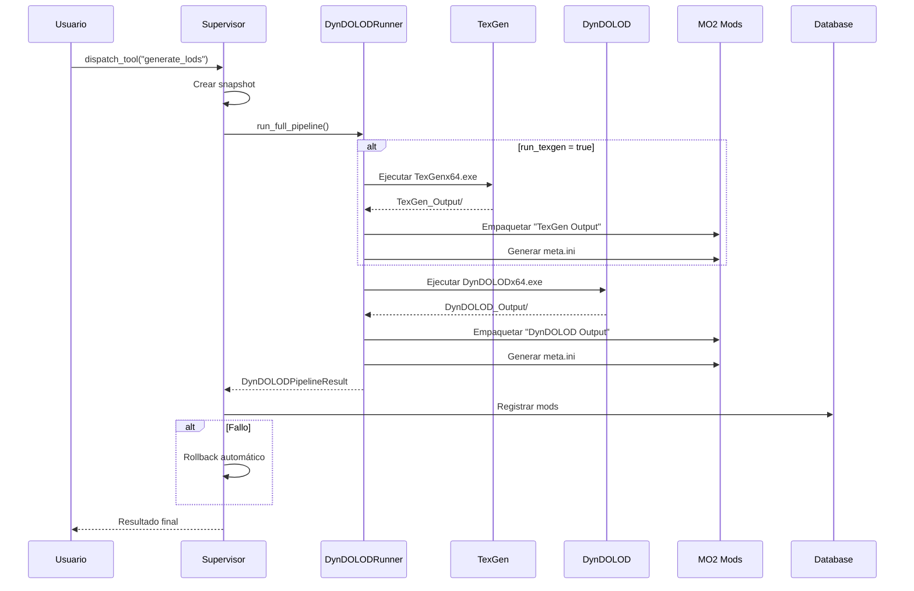

# Fase 4: Integración DynDOLOD & TexGen

> Documentación técnica de la implementación de generación automatizada de LODs para Sky Claw

## Tabla de Contenidos

- [1. Resumen Ejecutivo](#1-resumen-ejecutivo)
- [2. Arquitectura](#2-arquitectura)
- [3. Configuración](#3-configuración)
- [4. API Reference](#4-api-reference)
- [5. Flujo de Ejecución](#5-flujo-de-ejecución)
- [6. Sistema de Heartbeat](#6-sistema-de-heartbeat)
- [7. Manejo de Errores](#7-manejo-de-errores)
- [8. Ejemplos de Uso](#8-ejemplos-de-uso)
- [9. Troubleshooting](#9-troubleshooting)

---

## 1. Resumen Ejecutivo

### Objetivo de la Fase 4

La Fase 4 implementa la integración completa con **DynDOLOD** y **TexGen** para la generación automatizada de LODs (Level of Detail) en Skyrim Special Edition/Anniversary Edition, con empaquetado automático para Mod Organizer 2.

### Brecha Crítica que Cierra

Esta fase cierra la brecha crítica identificada como **GAP-004**: El sistema Sky Claw carecía de capacidad para generar LODs de forma automatizada, requiriendo intervención manual del usuario para ejecutar DynDOLOD/TexGen y empaquetar los resultados.

**Problemas resueltos:**

| Problema | Solución |
|----------|----------|
| Ejecución manual de herramientas externas | Pipeline automatizado con [`DynDOLODRunner`](../sky_claw/tools/dyndolod_runner.py:167) |
| Empaquetado manual de outputs | Método [`_package_output_as_mod()`](../sky_claw/tools/dyndolod_runner.py:527) |
| Falta de integración con MO2 | Generación automática de `meta.ini` |
| Sin manejo de procesos largos | Sistema de heartbeat con timeout de 4 horas |
| Ausencia de rollback | Integración con sistema de snapshots |

### Componentes Implementados

| Archivo | Descripción |
|---------|-------------|
| [`sky_claw/tools/dyndolod_runner.py`](../sky_claw/tools/dyndolod_runner.py) | Runner principal asíncrono |
| [`sky_claw/orchestrator/supervisor.py`](../sky_claw/orchestrator/supervisor.py) | Integración en el supervisor |
| [`sky_claw/orchestrator/state_graph.py`](../sky_claw/orchestrator/state_graph.py) | Estado `GENERATING_LODS` |

---

## 2. Arquitectura

### Diagrama de Componentes

```
┌─────────────────────────────────────────────────────────────────────────────┐
│                           SUPERVISOR AGENT                                   │
│  ┌─────────────────────────────────────────────────────────────────────┐    │
│  │                     dispatch_tool("generate_lods")                   │    │
│  └───────────────────────────────┬─────────────────────────────────────┘    │
│                                  │                                           │
│                                  ▼                                           │
│  ┌─────────────────────────────────────────────────────────────────────┐    │
│  │              execute_dyndolod_pipeline()                             │    │
│  │  ┌─────────────────┐  ┌──────────────────┐  ┌─────────────────┐     │    │
│  │  │ Create Snapshot │─▶│ Run TexGen       │─▶│ Package TexGen  │     │    │
│  │  └─────────────────┘  └──────────────────┘  └─────────────────┘     │    │
│  │                                  │                                   │    │
│  │                                  ▼                                   │    │
│  │  ┌─────────────────┐  ┌──────────────────┐  ┌─────────────────┐     │    │
│  │  │ Run DynDOLOD    │─▶│ Package DynDOLOD │─▶│ Register in DB  │     │    │
│  │  └─────────────────┘  └──────────────────┘  └─────────────────┘     │    │
│  └─────────────────────────────────────────────────────────────────────┘    │
└─────────────────────────────────────────────────────────────────────────────┘
                    │                              │
                    ▼                              ▼
        ┌───────────────────┐          ┌─────────────────────┐
        │   StateGraph      │          │   DynDOLODRunner    │
        │ GENERATING_LODS   │          │                     │
        └───────────────────┘          │  ┌───────────────┐  │
                    │                  │  │ run_texgen()  │  │
                    │                  │  └───────────────┘  │
                    ▼                  │  ┌───────────────┐  │
        ┌───────────────────┐          │  │run_dyndolod() │  │
        │ Valid Transitions │          │  └───────────────┘  │
        │ · COMPLETED       │          │  ┌───────────────┐  │
        │ · ERROR           │          │  │_execute_proc()│  │
        │ · ROLLING_BACK    │          │  └───────────────┘  │
        └───────────────────┘          └─────────────────────┘
                                               │
                                               ▼
                                   ┌─────────────────────┐
                                   │   MO2 VFS           │
                                   │   Integration       │
                                   │                     │
                                   │  TexGen Output/     │
                                   │  DynDOLOD Output/   │
                                   │  meta.ini           │
                                   └─────────────────────┘
```

### Flujo de Datos



---

## 3. Configuración

### Variables de Entorno Requeridas

| Variable | Descripción | Ejemplo |
|----------|-------------|---------|
| `DYNDLOD_EXE` | Ruta a DynDOLODx64.exe | `C:\Modding\DynDOLOD\DynDOLODx64.exe` |
| `TEXGEN_EXE` | Ruta a TexGenx64.exe | `C:\Modding\DynDOLOD\TexGenx64.exe` |
| `SKYRIM_PATH` | Directorio de Skyrim SE/AE | `C:\Games\Skyrim Special Edition` |
| `MO2_PATH` | Directorio de Mod Organizer 2 | `C:\Modding\MO2` |
| `MO2_MODS_PATH` | Carpeta mods de MO2 | `C:\Modding\MO2\mods` |

### Configuración Opcional

| Variable | Default | Descripción |
|----------|---------|-------------|
| `DYNDLOD_TIMEOUT` | `14400` | Timeout en segundos (4 horas) |
| `DYNDLOD_HEARTBEAT` | `60` | Intervalo de heartbeat en segundos |
| `DYNDLOD_PRESET` | `Medium` | Preset por defecto (Low/Medium/High) |

### Ejemplo de Configuración

```bash
# .env
DYNDLOD_EXE=C:\Modding\DynDOLOD\DynDOLODx64.exe
TEXGEN_EXE=C:\Modding\DynDOLOD\TexGenx64.exe
SKYRIM_PATH=C:\Games\Skyrim Special Edition
MO2_PATH=C:\Modding\MO2
MO2_MODS_PATH=C:\Modding\MO2\mods
DYNDLOD_TIMEOUT=14400
DYNDLOD_HEARTBEAT=60
```

---

## 4. API Reference

### DynDOLODConfig

Dataclass de configuración para la ejecución de DynDOLOD/TexGen.

**Ubicación:** [`sky_claw/tools/dyndolod_runner.py:86`](../sky_claw/tools/dyndolod_runner.py:86)

```python
@dataclass(frozen=True, slots=True)
class DynDOLODConfig:
    """Configuration for DynDOLOD/TexGen execution."""
    
    game_path: pathlib.Path        # Ruta al directorio del juego
    mo2_path: pathlib.Path         # Ruta al directorio de MO2
    mo2_mods_path: pathlib.Path    # Ruta a la carpeta mods de MO2
    dyndolod_exe: pathlib.Path     # Ruta al ejecutable de DynDOLOD
    texgen_exe: pathlib.Path | None = None     # Ruta a TexGen (opcional)
    timeout_seconds: int = 14400   # Timeout: 4 horas
    heartbeat_interval: int = 60   # Heartbeat cada 60 segundos
    preset: str = "Medium"         # Low, Medium, High
```

**Validación:**

- [`game_path`](../sky_claw/tools/dyndolod_runner.py:110) debe existir
- [`dyndolod_exe`](../sky_claw/tools/dyndolod_runner.py:112) debe existir

---

### DynDOLODRunner

Runner asíncrono para TexGen y DynDOLOD con empaquetado automático para MO2.

**Ubicación:** [`sky_claw/tools/dyndolod_runner.py:167`](../sky_claw/tools/dyndolod_runner.py:167)

#### Constructor

```python
def __init__(self, config: DynDOLODConfig) -> None
```

**Parámetros:**

| Parámetro | Tipo | Descripción |
|-----------|------|-------------|
| `config` | `DynDOLODConfig` | Configuración con paths y timeouts |

---

#### run_texgen()

Ejecuta TexGen en modo headless.

**Ubicación:** [`sky_claw/tools/dyndolod_runner.py:234`](../sky_claw/tools/dyndolod_runner.py:234)

```python
async def run_texgen(
    self,
    extra_args: list[str] | None = None
) -> ToolExecutionResult
```

**Parámetros:**

| Parámetro | Tipo | Default | Descripción |
|-----------|------|---------|-------------|
| `extra_args` | `list[str] \| None` | `None` | Argumentos adicionales de CLI |

**Returns:** [`ToolExecutionResult`](#toolexecutionresult)

**Raises:**

- `DynDOLODNotFoundError`: Si el ejecutable no existe
- `DynDOLODTimeoutError`: Si excede el timeout

**CLI generado:**

```bash
TexGenx64.exe -game TES5 -t [extra_args...]
```

---

#### run_dyndolod()

Ejecuta DynDOLOD en modo headless.

**Ubicación:** [`sky_claw/tools/dyndolod_runner.py:317`](../sky_claw/tools/dyndolod_runner.py:317)

```python
async def run_dyndolod(
    self,
    preset: str = "Medium",
    extra_args: list[str] | None = None
) -> ToolExecutionResult
```

**Parámetros:**

| Parámetro | Tipo | Default | Descripción |
|-----------|------|---------|-------------|
| `preset` | `str` | `"Medium"` | Nivel de calidad (Low/Medium/High) |
| `extra_args` | `list[str] \| None` | `None` | Argumentos adicionales de CLI |

**Returns:** [`ToolExecutionResult`](#toolexecutionresult)

**Raises:**

- `DynDOLODNotFoundError`: Si el ejecutable no existe
- `DynDOLODTimeoutError`: Si excede el timeout

**CLI generado:**

```bash
DynDOLODx64.exe -game TES5 -p Medium -t [extra_args...]
```

---

#### run_full_pipeline()

Ejecuta el pipeline completo: TexGen → Empaquetado → DynDOLOD → Empaquetado.

**Ubicación:** [`sky_claw/tools/dyndolod_runner.py:604`](../sky_claw/tools/dyndolod_runner.py:604)

```python
async def run_full_pipeline(
    self,
    run_texgen: bool = True,
    preset: str = "Medium",
    texgen_args: list[str] | None = None,
    dyndolod_args: list[str] | None = None
) -> DynDOLODPipelineResult
```

**Parámetros:**

| Parámetro | Tipo | Default | Descripción |
|-----------|------|---------|-------------|
| `run_texgen` | `bool` | `True` | Ejecutar TexGen antes de DynDOLOD |
| `preset` | `str` | `"Medium"` | Nivel de calidad |
| `texgen_args` | `list[str] \| None` | `None` | Args adicionales para TexGen |
| `dyndolod_args` | `list[str] \| None` | `None` | Args adicionales para DynDOLOD |

**Returns:** [`DynDOLODPipelineResult`](#dyndolodpipelineresult)

**Flujo de ejecución:**

1. Ejecutar TexGen (si `run_texgen=True`)
2. Empaquetar `TexGen_Output` como "TexGen Output"
3. Ejecutar DynDOLOD
4. Empaquetar `DynDOLOD_Output` como "DynDOLOD Output"

---

#### validate_dyndolod_output()

Valida que la salida de DynDOLOD sea válida.

**Ubicación:** [`sky_claw/tools/dyndolod_runner.py:892`](../sky_claw/tools/dyndolod_runner.py:892)

```python
async def validate_dyndolod_output(
    self,
    output_path: pathlib.Path
) -> bool
```

**Validaciones:**

- El directorio existe y tiene contenido
- Contiene archivos `.esp`
- `DynDOLOD.esp` está presente

---

### Data Classes de Resultado

#### ToolExecutionResult

Resultado de una ejecución individual (TexGen o DynDOLOD).

**Ubicación:** [`sky_claw/tools/dyndolod_runner.py:116`](../sky_claw/tools/dyndolod_runner.py:116)

```python
@dataclass(frozen=True, slots=True)
class ToolExecutionResult:
    success: bool                          # True si exitoso
    tool_name: str                         # "TexGen" o "DynDOLOD"
    return_code: int                       # Código de retorno
    stdout: str                            # Salida estándar
    stderr: str                            # Salida de error
    output_path: pathlib.Path | None       # Path al output
    errors: list[str]                      # Lista de errores
    warnings: list[str]                    # Lista de warnings
    duration_seconds: float                # Duración en segundos
```

---

#### DynDOLODPipelineResult

Resultado completo del pipeline.

**Ubicación:** [`sky_claw/tools/dyndolod_runner.py:142`](../sky_claw/tools/dyndolod_runner.py:142)

```python
@dataclass(frozen=True, slots=True)
class DynDOLODPipelineResult:
    success: bool                              # True si todo exitoso
    texgen_result: ToolExecutionResult | None  # Resultado de TexGen
    dyndolod_result: ToolExecutionResult | None # Resultado de DynDOLOD
    texgen_mod_path: pathlib.Path | None       # Path al mod de TexGen
    dyndolod_mod_path: pathlib.Path | None     # Path al mod de DynDOLOD
    errors: list[str]                          # Errores acumulados
```

---

### SupervisorAgent Integration

#### execute_dyndolod_pipeline()

Método del supervisor que ejecuta el pipeline completo con soporte transaccional.

**Ubicación:** [`sky_claw/orchestrator/supervisor.py:743`](../sky_claw/orchestrator/supervisor.py:743)

```python
async def execute_dyndolod_pipeline(
    self,
    preset: str = "Medium",
    run_texgen: bool = True,
    create_snapshot: bool = True,
    texgen_args: list[str] | None = None,
    dyndolod_args: list[str] | None = None
) -> DynDOLODPipelineResult
```

**Parámetros:**

| Parámetro | Tipo | Default | Descripción |
|-----------|------|---------|-------------|
| `preset` | `str` | `"Medium"` | Nivel de calidad |
| `run_texgen` | `bool` | `True` | Ejecutar TexGen |
| `create_snapshot` | `bool` | `True` | Crear snapshot para rollback |
| `texgen_args` | `list[str] \| None` | `None` | Args para TexGen |
| `dyndolod_args` | `list[str] \| None` | `None` | Args para DynDOLOD |

**Características adicionales vs `run_full_pipeline()`:**

- Integración con sistema de snapshots
- Registro en journal de operaciones
- Rollback automático en caso de fallo
- Registro de mods en base de datos

---

## 5. Flujo de Ejecución

### Secuencia Completa

```
┌─────────────────────────────────────────────────────────────────────┐
│                    FLUJO DE EJECUCIÓN                               │
└─────────────────────────────────────────────────────────────────────┘

1. Usuario invoca "generate_lods"
   │
   ▼
2. Supervisor.dispatch_tool("generate_lods", {...})
   │
   ▼
3. Supervisor.execute_dyndolod_pipeline()
   │
   ├──▶ 3.1 Crear snapshot de DynDOLOD.esp existente
   │
   ├──▶ 3.2 Registrar inicio en journal
   │
   ▼
4. DynDOLODRunner.run_full_pipeline()
   │
   ├──▶ 4.1 [Si run_texgen=True]
   │        │
   │        ├──▶ Ejecutar TexGenx64.exe -game TES5 -t
   │        │
   │        ├──▶ Buscar TexGen_Output/
   │        │
   │        ├──▶ _package_output_as_mod("TexGen Output")
   │        │        │
   │        │        ├──▶ Crear directorio en MO2/mods/
   │        │        ├──▶ Copiar contenido
   │        │        └──▶ Generar meta.ini
   │
   ├──▶ 4.2 Ejecutar DynDOLODx64.exe -game TES5 -p <preset> -t
   │
   ├──▶ 4.3 Buscar DynDOLOD_Output/
   │
   ├──▶ 4.4 _package_output_as_mod("DynDOLOD Output")
   │
   ▼
5. Registrar mods en base de datos
   │
   ├──▶ db.add_mod("TexGen Output", ...)
   │
   └──▶ db.add_mod("DynDOLOD Output", ...)
   │
   ▼
6. Registrar resultado en journal
   │
   ▼
7. Retornar DynDOLODPipelineResult

┌─────────────────────────────────────────────────────────────────────┐
│                    ROLLBACK (si falla)                              │
└─────────────────────────────────────────────────────────────────────┘

   Error → _rollback_dyndolod_on_failure()
              │
              └──▶ Restaurar snapshot anterior
```

### Estado del StateGraph

La Fase 4 introduce el estado [`GENERATING_LODS`](../sky_claw/orchestrator/state_graph.py:67) en el StateGraph:

```python
class SupervisorState(str, Enum):
    # ... estados existentes ...
    GENERATING_LODS = "generating_lods"  # FASE 4
```

**Transiciones válidas:**

| Desde | Hacia |
|-------|-------|
| `DISPATCHING` | `GENERATING_LODS` |
| `GENERATING_LODS` | `COMPLETED` |
| `GENERATING_LODS` | `ERROR` |
| `GENERATING_LODS` | `ROLLING_BACK` |

---

## 6. Sistema de Heartbeat

### Propósito

El sistema de heartbeat previene que el proceso sea marcado como "zombie" durante ejecuciones prolongadas (hasta 4 horas).

### Configuración

| Parámetro | Valor | Descripción |
|-----------|-------|-------------|
| `timeout_seconds` | `14400` | 4 horas máximo |
| `heartbeat_interval` | `60` | Log cada 60 segundos |

### Implementación

**Ubicación:** [`sky_claw/tools/dyndolod_runner.py:395`](../sky_claw/tools/dyndolod_runner.py:395)

```python
async def _execute_process(
    self,
    executable: pathlib.Path,
    args: list[str],
    tool_name: str,
    timeout: int | None = None,
) -> tuple[str, str, int, float]:
    # ...
    while True:
        try:
            # Leer con timeout corto para emitir heartbeats
            stdout_data, stderr_data = await asyncio.wait_for(
                proc.communicate(),
                timeout=min(heartbeat_interval, effective_timeout),
            )
            break
        except asyncio.TimeoutError:
            # Emitir heartbeat
            elapsed = time.monotonic() - start_time
            if elapsed >= heartbeat_interval:
                logger.info(
                    "%s heartbeat: %.1fs elapsed, process still running",
                    tool_name,
                    elapsed,
                )
            
            # Verificar timeout global
            if elapsed >= effective_timeout:
                proc.kill()
                raise DynDOLODTimeoutError(effective_timeout, tool_name)
```

### Logs de Heartbeat

```
INFO - DynDOLOD heartbeat: 60.0s elapsed, process still running
INFO - DynDOLOD heartbeat: 120.0s elapsed, process still running
INFO - DynDOLOD heartbeat: 180.0s elapsed, process still running
...
```

---

## 7. Manejo de Errores

### Jerarquía de Excepciones

```
DynDOLODExecutionError (base)
├── DynDOLODTimeoutError
├── DynDOLODNotFoundError
└── DynDOLODValidationError
```

### DynDOLODExecutionError

Excepción base para errores de ejecución.

**Ubicación:** [`sky_claw/tools/dyndolod_runner.py:33`](../sky_claw/tools/dyndolod_runner.py:33)

```python
class DynDOLODExecutionError(Exception):
    def __init__(
        self,
        message: str,
        return_code: int | None = None,
        stderr: str | None = None,
    ) -> None:
        super().__init__(message)
        self.return_code = return_code
        self.stderr = stderr
```

---

### DynDOLODTimeoutError

Se lanza cuando la ejecución excede el timeout.

**Ubicación:** [`sky_claw/tools/dyndolod_runner.py:47`](../sky_claw/tools/dyndolod_runner.py:47)

```python
class DynDOLODTimeoutError(DynDOLODExecutionError):
    def __init__(self, timeout_seconds: int, tool_name: str = "DynDOLOD") -> None:
        # ...
        self.timeout_seconds = timeout_seconds
        self.tool_name = tool_name
```

---

### DynDOLODNotFoundError

Se lanza cuando el ejecutable no puede ser encontrado.

**Ubicación:** [`sky_claw/tools/dyndolod_runner.py:60`](../sky_claw/tools/dyndolod_runner.py:60)

```python
class DynDOLODNotFoundError(DynDOLODExecutionError):
    def __init__(self, executable_path: pathlib.Path) -> None:
        # ...
        self.executable_path = executable_path
```

---

### DynDOLODValidationError

Se lanza cuando la validación de salida falla.

**Ubicación:** [`sky_claw/tools/dyndolod_runner.py:72`](../sky_claw/tools/dyndolod_runner.py:72)

```python
class DynDOLODValidationError(DynDOLODExecutionError):
    def __init__(self, message: str, output_path: pathlib.Path | None = None) -> None:
        # ...
        self.output_path = output_path
```

---

## 8. Ejemplos de Uso

### Ejemplo Básico

Ejecución simple con valores por defecto:

```python
from sky_claw.orchestrator.supervisor import SupervisorAgent

# Crear supervisor
supervisor = SupervisorAgent(profile_name="Default")

# Ejecutar pipeline de LODs
result = await supervisor.dispatch_tool("generate_lods", {
    "preset": "Medium",
    "run_texgen": True
})

if result.success:
    print(f"TexGen mod: {result.texgen_mod_path}")
    print(f"DynDOLOD mod: {result.dyndolod_mod_path}")
else:
    print(f"Errores: {result.errors}")
```

### Ejemplo Avanzado

Con configuración personalizada:

```python
from sky_claw.orchestrator.supervisor import SupervisorAgent

supervisor = SupervisorAgent(profile_name="Default")

# Ejecutar con preset High y argumentos personalizados
result = await supervisor.execute_dyndolod_pipeline(
    preset="High",
    run_texgen=True,
    create_snapshot=True,
    texgen_args=["-v"],  # Verbose
    dyndolod_args=["--output", "custom_output"]
)

# Verificar resultados individuales
if result.texgen_result:
    print(f"TexGen duración: {result.texgen_result.duration_seconds}s")
    print(f"TexGen warnings: {len(result.texgen_result.warnings)}")

if result.dyndolod_result:
    print(f"DynDOLOD código retorno: {result.dyndolod_result.return_code}")
```

### Ejemplo Directo con DynDOLODRunner

Uso sin supervisor:

```python
import pathlib
from sky_claw.tools.dyndolod_runner import (
    DynDOLODRunner,
    DynDOLODConfig,
)

# Crear configuración
config = DynDOLODConfig(
    game_path=pathlib.Path("C:/Games/Skyrim Special Edition"),
    mo2_path=pathlib.Path("C:/Modding/MO2"),
    mo2_mods_path=pathlib.Path("C:/Modding/MO2/mods"),
    dyndolod_exe=pathlib.Path("C:/Modding/DynDOLOD/DynDOLODx64.exe"),
    texgen_exe=pathlib.Path("C:/Modding/DynDOLOD/TexGenx64.exe"),
    timeout_seconds=14400,
    preset="Medium",
)

# Crear runner
runner = DynDOLODRunner(config)

# Ejecutar solo DynDOLOD (sin TexGen)
result = await runner.run_dyndolod(preset="High")

print(f"Éxito: {result.success}")
print(f"Output: {result.output_path}")
```

### Ejemplo con Manejo de Errores

```python
from sky_claw.tools.dyndolod_runner import (
    DynDOLODRunner,
    DynDOLODConfig,
    DynDOLODTimeoutError,
    DynDOLODNotFoundError,
    DynDOLODExecutionError,
)

try:
    result = await runner.run_full_pipeline(preset="High")
    
    if not result.success:
        for error in result.errors:
            print(f"Error: {error}")
            
except DynDOLODTimeoutError as e:
    print(f"Timeout después de {e.timeout_seconds}s")
    
except DynDOLODNotFoundError as e:
    print(f"Ejecutable no encontrado: {e.executable_path}")
    
except DynDOLODExecutionError as e:
    print(f"Error de ejecución (code {e.return_code}): {e.stderr}")
```

---

## 9. Troubleshooting

### Tabla de Problemas Comunes

| Error | Causa | Solución |
|-------|-------|----------|
| `Executable not found` | Path incorrecto | Verificar `DYNDLOD_EXE` / `TEXGEN_EXE` |
| `Timeout` | Proceso muy largo | Aumentar `timeout_seconds` |
| `Validation failed` | Permisos de escritura | Ejecutar como administrador |
| `Game path does not exist` | Path de Skyrim incorrecto | Verificar `SKYRIM_PATH` |
| `Output directory is empty` | Ejecución falló silenciosamente | Revisar `stderr` del resultado |

### Diagnóstico Paso a Paso

#### 1. Verificar Variables de Entorno

```python
import os

required_vars = [
    "DYNDLOD_EXE",
    "TEXGEN_EXE",
    "SKYRIM_PATH",
    "MO2_PATH",
    "MO2_MODS_PATH",
]

for var in required_vars:
    value = os.environ.get(var)
    if value:
        print(f"✓ {var} = {value}")
    else:
        print(f"✗ {var} NO CONFIGURADO")
```

#### 2. Verificar Existencia de Archivos

```python
import pathlib
import os

dyndolod_exe = pathlib.Path(os.environ.get("DYNDLOD_EXE", ""))
texgen_exe = pathlib.Path(os.environ.get("TEXGEN_EXE", ""))

print(f"DynDOLOD existe: {dyndolod_exe.exists()}")
print(f"TexGen existe: {texgen_exe.exists()}")
```

#### 3. Habilitar Logs Detallados

```python
import logging

# Habilitar debug logging
logging.getLogger("SkyClaw").setLevel(logging.DEBUG)
```

#### 4. Probar Ejecución Manual

```bash
# Ejecutar TexGen manualmente para verificar
C:\Modding\DynDOLOD\TexGenx64.exe -game TES5 -t

# Ejecutar DynDOLOD manualmente para verificar
C:\Modding\DynDOLOD\DynDOLODx64.exe -game TES5 -p Medium -t
```

### Errores Específicos

#### Error: "CREATE_NO_WINDOW failed"

**Causa:** Problema con flags de creación de proceso en Windows.

**Solución:** Verificar que se está ejecutando en Windows:

```python
import sys
print(f"Plataforma: {sys.platform}")  # Debe ser "win32"
```

#### Error: "Permission denied creating mod"

**Causa:** Sin permisos de escritura en `MO2_MODS_PATH`.

**Solución:**

1. Verificar permisos del directorio
2. Ejecutar como administrador
3. Verificar que MO2 no tiene bloqueado el directorio

#### Error: "TexGen output not found"

**Causa:** TexGen no generó salida o está en ubicación no esperada.

**Ubicaciones buscadas:**

```python
search_paths = [
    mo2_path / "TexGen_Output",
    dyndolod_exe.parent / "TexGen_Output",
    pathlib.Path.cwd() / "TexGen_Output",
]
```

**Solución:** Verificar que TexGen completó exitosamente y buscar manualmente el directorio de salida.

---

## Referencias

- [DynDOLOD CLI Documentation](https://dyndolod.info/Help/Command-Line-Interface)
- [`synthesis_runner.py`](../sky_claw/tools/synthesis_runner.py) - Patrón de referencia para subprocess
- [`state_graph.py`](../sky_claw/orchestrator/state_graph.py) - Estados del supervisor
- [`supervisor.py`](../sky_claw/orchestrator/supervisor.py) - Integración principal

---

*Documentación generada para Sky Claw - Fase 4: DynDOLOD Integration*
