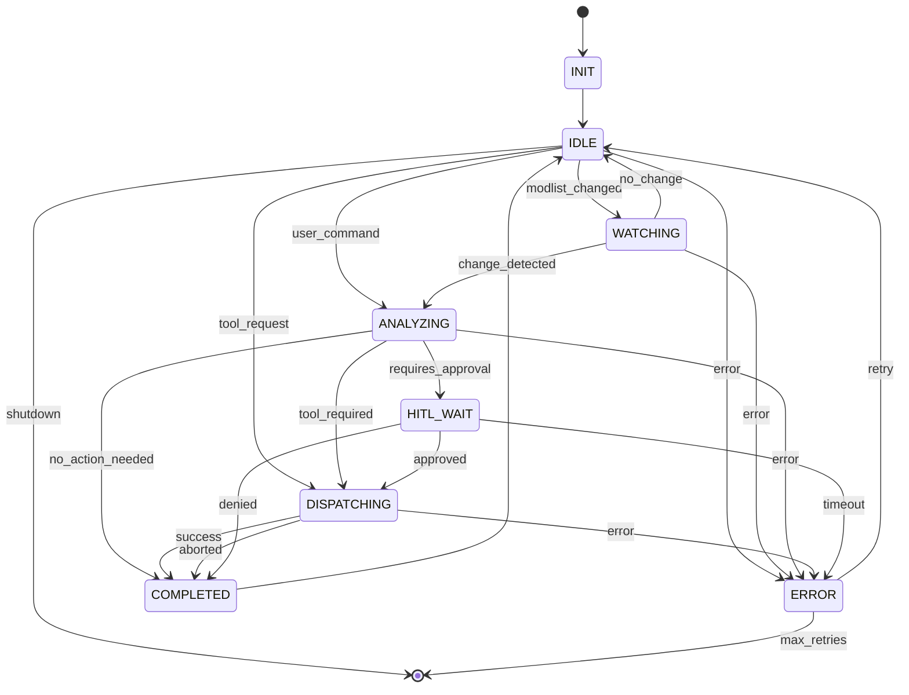

# LangGraph StateGraph Integration for Sky-Claw

## Overview

This document describes the LangGraph StateGraph integration implemented for the SupervisorAgent in Sky-Claw. The integration provides stateful workflow orchestration with conditional transitions, checkpointing, and graceful degradation.

## Status

- **Implemented:** 2026-04-03
- **Tests:** 33/33 passed
- **LangGraph Available:** Optional (graceful degradation supported)

## Architecture

### States

The `SupervisorState` enum defines all possible states in the workflow:

| State | Description |
|-------|-------------|
| `INIT` | Initial state when workflow starts |
| `IDLE` | Waiting for events |
| `WATCHING` | Monitoring modlist changes |
| `ANALYZING` | Processing detected changes |
| `DISPATCHING` | Executing tools |
| `HITL_WAIT` | Waiting for human approval |
| `COMPLETED` | Operation finished successfully |
| `ERROR` | Error state with retry logic |

### Events

The `WorkflowEventType` enum defines events that trigger transitions:

| Event | Description |
|-------|-------------|
| `MODLIST_CHANGED` | Modlist.txt modification detected |
| `USER_COMMAND` | Command from user interface |
| `TOOL_REQUEST` | Tool execution request |
| `HITL_RESPONSE` | Human-in-the-loop response |
| `ERROR_OCCURRED` | Error during execution |
| `TIMEOUT` | Operation timeout |
| `SHUTDOWN` | System shutdown request |

### State Transitions



## Usage

### Basic Usage

```python
from sky_claw.orchestrator.state_graph import (
    SupervisorStateGraph,
    WorkflowEventType,
    create_supervisor_state_graph
)

# Create state graph
state_graph = create_supervisor_state_graph(profile_name="Default")

# Get initial state
initial_state = state_graph.get_initial_state()

# Execute workflow
result = await state_graph.execute(initial_state)
```

### Submitting Events

```python
# Submit a modlist change event
result = await state_graph.submit_event(
    WorkflowEventType.MODLIST_CHANGED,
    {"mtime": 12345.0, "path": "/path/to/modlist.txt"}
)

# Submit a user command
result = await state_graph.submit_event(
    WorkflowEventType.USER_COMMAND,
    {"command": "analyze_conflicts", "params": {}}
)
```

### Integration with SupervisorAgent

```python
from sky_claw.orchestrator.state_graph import StateGraphIntegration
from sky_claw.orchestrator.supervisor import SupervisorAgent

# Create components
supervisor = SupervisorAgent(profile_name="Default")
state_graph = create_supervisor_state_graph(profile_name="Default")

# Connect them
integration = StateGraphIntegration(state_graph)
integration.connect_supervisor(supervisor)

# Translate events
event = integration.translate_modlist_event(mtime=12345.0, path="/path/to/modlist.txt")
result = await state_graph.submit_event(event["event_type"], event["event_data"])
```

### Visualization

```python
# Get Mermaid diagram
diagram = state_graph.get_mermaid_diagram()
print(diagram)

# Save to file (requires LangGraph installed)
state_graph.visualize(output_path="state_graph.png")
```

## Graceful Degradation

When LangGraph is not installed, the system automatically falls back to a simplified implementation:

```python
from sky_claw.orchestrator.state_graph import LANGGRAPH_AVAILABLE

if LANGGRAPH_AVAILABLE:
    print("Full LangGraph functionality available")
else:
    print("Using fallback implementation")
```

The fallback implementation:
- Provides basic state transitions
- Maintains state structure compatibility
- Supports all event types
- Works with existing tests

## Components

### StateGraphNodes

Static methods that implement node logic:

- `init_node()` - Initialize workflow
- `idle_node()` - Wait for events
- `watching_node()` - Monitor for changes
- `analyzing_node()` - Process events
- `dispatching_node()` - Execute tools
- `hitl_wait_node()` - Wait for approval
- `completed_node()` - Finalize operation
- `error_node()` - Handle errors

### StateGraphEdges

Static methods that implement conditional routing:

- `route_from_idle()` - Route based on pending event
- `route_from_watching()` - Route based on change detection
- `route_from_analyzing()` - Route based on tool requirements
- `route_from_hitl_wait()` - Route based on HITL response
- `route_from_dispatching()` - Route based on tool result
- `route_from_error()` - Route based on retry count

### WorkflowState

Pydantic model (when available) for validated state:

```python
class WorkflowState(BaseModel):
    workflow_id: str
    current_state: SupervisorState
    previous_state: Optional[SupervisorState]
    profile_name: str
    modlist_path: Optional[str]
    last_mtime: float
    pending_event: Optional[WorkflowEventType]
    event_data: Dict[str, Any]
    tool_name: Optional[str]
    tool_payload: Dict[str, Any]
    tool_result: Optional[Dict[str, Any]]
    hitl_request: Optional[Dict[str, Any]]
    hitl_response: Optional[str]
    transition_history: List[Dict[str, Any]]
    last_error: Optional[str]
    error_count: int
```

## Configuration

### Environment Variables

- `LANGGRAPH_ENABLED` - Set to "false" to disable LangGraph even if installed
- `LANGGRAPH_CHECKPOINT_DIR` - Directory for checkpoint storage (default: in-memory)

### Retry Configuration

The error state supports configurable retries:

```python
# In StateGraphEdges.route_from_error()
max_retries = 3  # Configurable
if error_count >= max_retries:
    return END
return SupervisorState.IDLE.value
```

## Testing

Run tests with:

```bash
cd sky-claw
python -m pytest tests/test_state_graph.py -v
```

Test coverage includes:
- State value verification
- Event type validation
- Node function behavior
- Edge routing logic
- Fallback execution
- Graceful degradation

## Dependencies

### Required

- Python >= 3.10
- Pydantic >= 2.0 (optional but recommended)

### Optional

- LangGraph >= 0.0.20 (for full functionality)

Install LangGraph:

```bash
pip install langgraph
```

## Files

| File | Description |
|------|-------------|
| `sky_claw/orchestrator/state_graph.py` | Main implementation |
| `sky_claw/orchestrator/__init__.py` | Package exports |
| `tests/test_state_graph.py` | Test suite |
| `docs/LANGGRAPH-STATEGRAFH-INTEGRATION.md` | This documentation |

## Future Enhancements

1. **Persistent Checkpointing** - Save workflow state to SQLite
2. **Parallel Execution** - Support concurrent tool dispatch
3. **Workflow Templates** - Predefined workflows for common operations
4. **Metrics Collection** - Track state transition timing
5. **A/B Testing** - Compare different workflow strategies

---

*Documentation generated: 2026-04-03*
